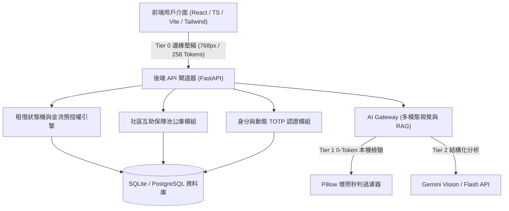
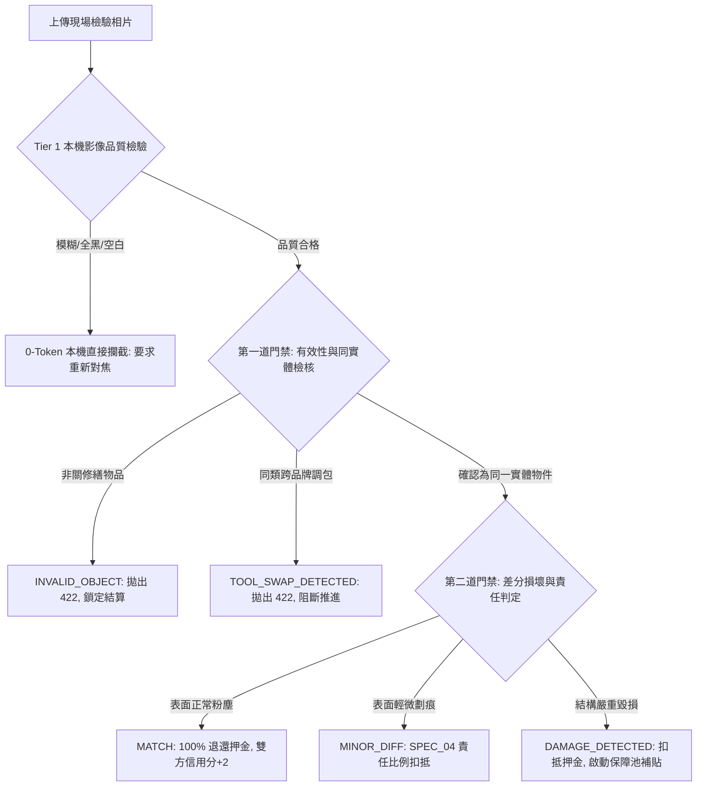

# LinLi Tool (鄰里工具) - 系統架構設計規範 (Architecture Guide)

本規範定義 LinLi Tool 社區工具共享與維護平台之核心系統架構、微服務/模組劃分、資料流向與安全存證設計準則。

---

## 一、 系統架構總覽與分層職責

系統採用前後端分離之高內聚低耦合架構，結合邊緣運算與多模態 AI Gateway：

### 1. 前端層 (Frontend Presentation Layer)
- **職責**：視覺呈現、表單互動、狀態展示、相片拍攝引導（Ghost Overlay 殘影對齊與 45 度引導線）。
- **關鍵責任**：執行 **Tier 0 邊緣等比壓縮**（最長邊 768px，JPEG 85%），將相片鎖定在 1 個 Tile (258 Tokens)，杜絕原始 4K 巨圖直傳。

### 2. 應用閘道層 (Application & API Layer - FastAPI)
- **職責**：RESTful API 提供、JWT 身分驗證、社區多租戶邊界判定、並發預約排他排程鎖定。
- **原則**：**Backend-First API**，所有身分、金額、比對與狀態推進必須由後端權威計算，前端禁止私自推進訂單狀態。

### 3. AI Gateway 與多模態層
- **職責**：整合 Gemini Vision 多模態比對、本地 RAG 向量/關鍵字檢索、防調包與品項一致性核驗。
- **快取與限流**：MD5 影像特徵快取、每分鐘每用戶 5 次呼叫冷卻保護。

### 4. 資料持久與存證層 (Data & Audit Trail Layer)
- **職責**：關聯式資料庫存儲、訂單狀態機、動態 TOTP 碼紀錄、SHA-256 相片存證雜湊鏈、互助保障池公庫金流帳本。

---

## 二、 Vision AI 雙階段驗收門禁架構 (Two-Stage Inspection Gate)

為確保工具驗收的精準度與安全性，全系統嚴格落實**兩階段防禦門禁架構**：

1. **Gate 1 (有效性與同實體檢核 - Validity & Same-Entity Gate)**：
   - 凡上傳馬克杯、文具等無關生活雜物，立即標記為 `INVALID_OBJECT` 並中斷流程。
   - 凡借出與歸還品牌銘牌不符（如原借出 Bosch，歸還牧田 Makita），立即標記為 `TOOL_SWAP_DETECTED`。
   - 未通過 Gate 1 時，禁止進入 Gate 2 損壞差分計算，後端拋出 HTTP 422，清空存證雜湊。
2. **Gate 2 (差分損壞與責任計算 - Differential Inspection Gate)**：
   - 僅在通過 Gate 1 確認為「同一實體物件」後，方才對比磨損程度。

---

## 三、 Fail-Closed 容錯架構準則

系統在處理 AI 推論、網路降級或格式異常時，嚴格採取 **Fail-Closed (預設關閉/預設安全)** 原則：

1. **不確定即拒絕**：
   - 當 AI 回傳信心度低於門檻（`< 0.60`）、JSON 解析失敗或遇到未知例外，一律回傳 `requires_retake=True` 與 `is_same_object=False`。
   - 嚴禁設計「若非特定錯誤即預設放行」的鬆散邏輯。
2. **狀態機鎖定保護**：
   - 比對異常時，訂單維持在當前狀態或推進至 `INSPECTION` / `DISPUTED`，嚴禁自動推進至 `IN_USE` 或 `COMPLETED`。

---

## 四、 信任與存證鏈架構 (Trust & Audit Trail)

1. **動態 TOTP 見面安全核銷**：
   - 取件交接時，借用人端生成 60 秒動態 TOTP 6 碼取件碼。
   - 出借人輸入驗證成功後，系統方推進至 `PICKED_UP`，確保實體交付真實發生。
2. **SHA-256 不可篡改存證**：
   - Check-in 現場取件同物件核驗通過後，後端即時計算現場照片之 SHA-256 Checksum 並存入訂單資料庫。
   - 歸還驗收 (Check-out) 與爭議調解 (Disputes) 時，強制比對該 Checksum，保證原始證據鏈不可篡改。

---

## 五、 社區多租戶與安全邊界 (Multi-Tenancy & Isolation)

1. **社區資料邊界 (Community Boundary Isolation)**：
   - 工具探索、預約訂單、借還交接與保障池公庫皆以 `community_id` 為最高邊界，嚴禁跨社區水平越權 (IDOR)。
2. **並發排他排程鎖 (Schedule Concurrency Lock)**：
   - 建立訂單時，針對同檔期工具已存在的 `CONFIRMED`、`PICKED_UP`、`IN_USE` 訂單執行重疊時段檢核，命中即刻回傳 HTTP 409 Conflict。

---

## 六、 主管機關微文案合規原則 (Zero Forbidden Words)

架構中之資料模型、API 欄位、Prompt 與輸出結構，嚴格遵從金管會金融法規：
- ❌ **絕對嚴禁名詞**：「保險」、「保費」、「理賠」。
- ✅ **法定合規專有名詞**：
  - 「互助保障池」 (Mutual Protection Pool)
  - 「互助保障金」 或 「維護費」 (Protection Fee / Maintenance Surcharge)
  - 「責任補貼」 或 「損害補償」 (Liability Subsidy / Compensation Payout)
