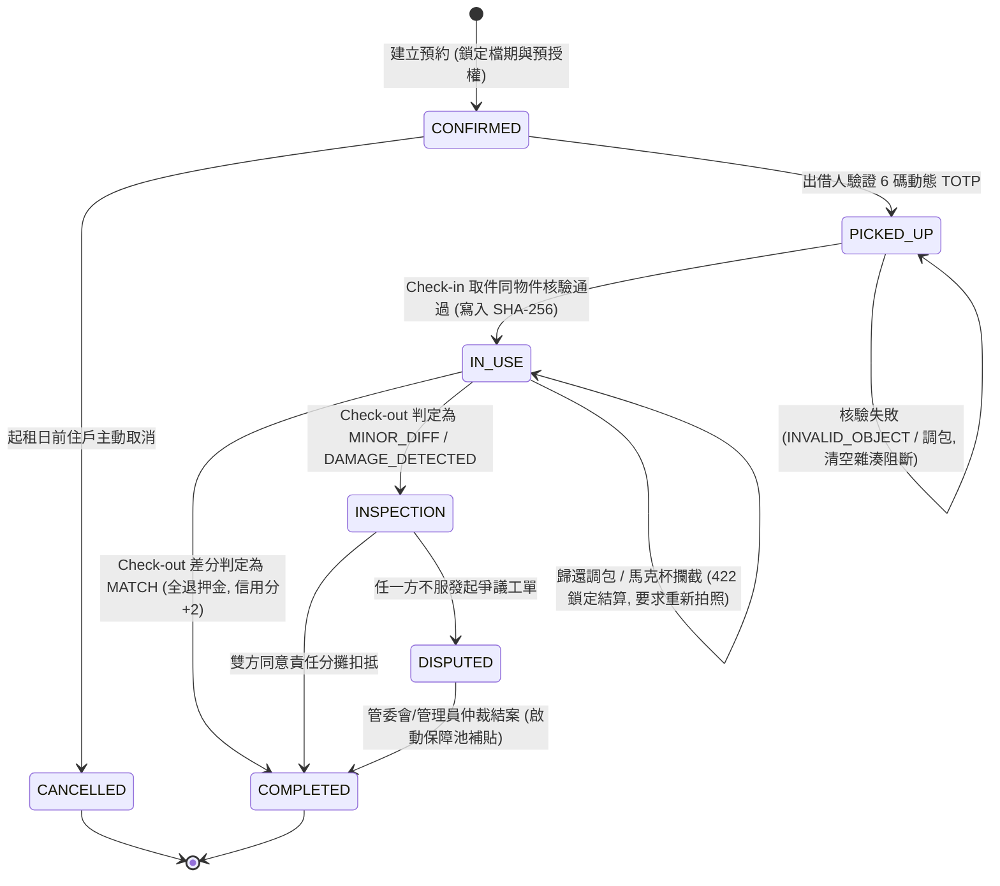
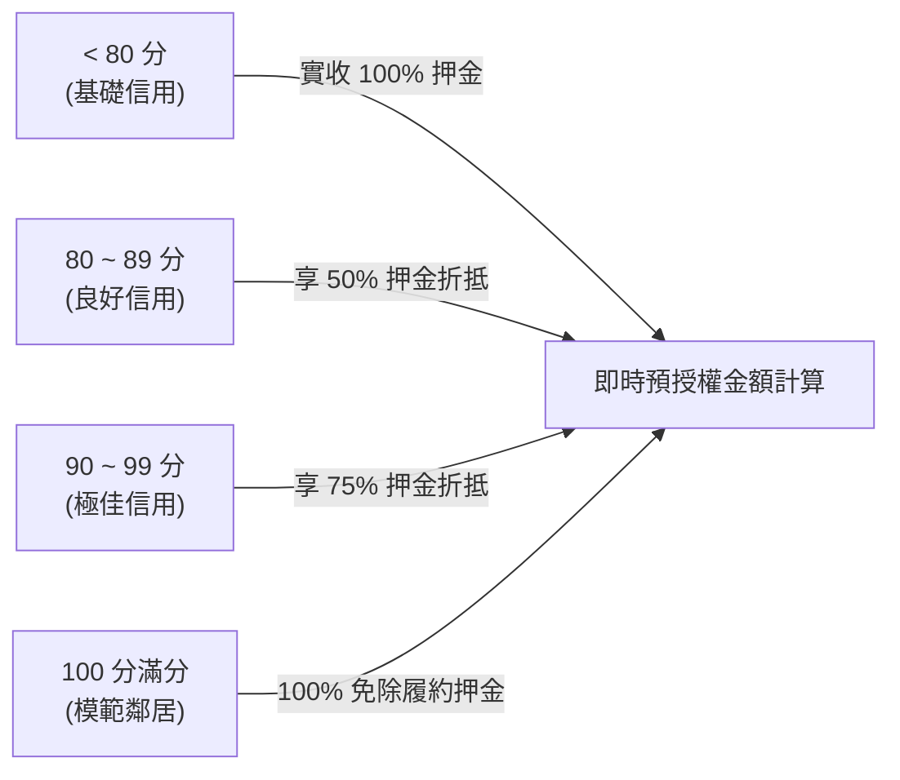

# LinLi Tool (鄰里工具) - 狀態機與狀態管理規範 (State Management Guide)

本規範定義 LinLi Tool 系統中訂單生命週期狀態機、信用評分動態階梯、前端狀態同步與交易一致性防護原則。

---

## 一、 租借訂單權威狀態機 (Order Lifecycle FSM)

訂單狀態轉換由後端資料庫與業務邏輯嚴格約束，任何前端狀態變更僅為後端結果之投射：

### 狀態定義與推進條件

| 狀態 (Status) | 意義與說明 | 推進先決條件 (Preconditions) |
| :--- | :--- | :--- |
| `CONFIRMED` | 訂單已建立，排他檔期已鎖定 | 住戶通過社區身分驗證，無檔期衝突，預授權金額試算完成 |
| `PICKED_UP` | 實體工具已在現場交接 | 借用人出示 TOTP，出借人輸入 6 碼核銷驗證成功 |
| `IN_USE` | 工具正式啟用 | **雙階段第一道門禁通過**：現場照片確認為同物件，生成 SHA-256 存證 |
| `INSPECTION` | 待驗收審查（有損壞痕跡） | Check-out 差分比對判定為正常磨損或損壞，等待責任比例確認 |
| `DISPUTED` | 款項凍結，爭議調解中 | 當事人發起爭議工單，自動凍結尾款撥付 |
| `COMPLETED` | 訂單圓滿結案 | 押金退還完成、租金撥付、保障池 5% 提撥入庫、信用分獎勵記入 |
| `CANCELLED` | 訂單已取消 | 起租日前依取消規則釋放預授權額度與檔期排他鎖 |

---

## 二、 狀態推進門禁與防竄改原則 (Integrity Protection)

1. **嚴禁跳級推進 (No Status Skipping)**：
   - 訂單絕對禁止從 `CONFIRMED` 直接跳至 `IN_USE`（必須依序通過 TOTP 見面核銷與現場同物件驗核）。
   - 訂單絕對禁止從未取件直接執行 `Check-out`。
2. **失敗清空與回滾原則 (Fail-Reset)**：
   - 若現場 Check-in 拍照被判定為 `INVALID_OBJECT`（生活雜物）或 `TOOL_SWAP_DETECTED`（品牌調包）：
     - 前端必須清空存證雜湊（SHA-256 Checksum）。
     - 訂單維持在 `PICKED_UP` 狀態，推進按鈕強制維持 Disabled。
3. **悲觀更新原則 (Pessimistic UI Updates)**：
   - 涉及身分存證、訂單狀態轉換、金流押金扣抵與爭議立案之操作，**前端嚴禁使用樂觀更新 (Optimistic Update)**。
   - 必須等待後端權威 API 回傳 HTTP 200/201 後，方可變更畫面狀態。

---

## 三、 信用評分浮動階梯管理 (Credit Score Dynamic Tiering)

LinLi Tool 依據住戶歷史履約記錄計算浮動信用評分，並即時影響押金減免：

### 信用分獎懲狀態規則
1. **正常履約獎勵**：Check-out 判定為 `MATCH` 且準時歸還，租借雙方各獲得 **+2 信用分**。
2. **惡意違約懲罰**：經管委會仲裁判定為惡意調包、蓄意損壞或逾期失聯，扣除 **15~30 信用分**。
3. **降級處置**：信用分低於 70 分之住戶，暫停發起新工具借用權限。

---

## 四、 前端 React 狀態管理最佳實踐

1. **模組化 Context 與 Hook 封裝**：
   - 認證與社區狀態：`useAuth()`（包含目前登入住戶、社區 ID、信用分）。
   - 訂單當前狀態：`useOrderWorkflow(orderId)`（封裝 TOTP 輪詢、Check-in/Check-out 上傳狀態、SHA-256 計算結果）。
2. **非同步狀態四元組規範**：
   - 每個 AI 分析與 API 互動必須完整管理：`data`, `isLoading`, `isError`, `errorMessage`。
   - 分析期間必須呈現「AI 差分分析中，預估耗時 2~3 秒」之進度指示器，禁止無響應卡頓。
