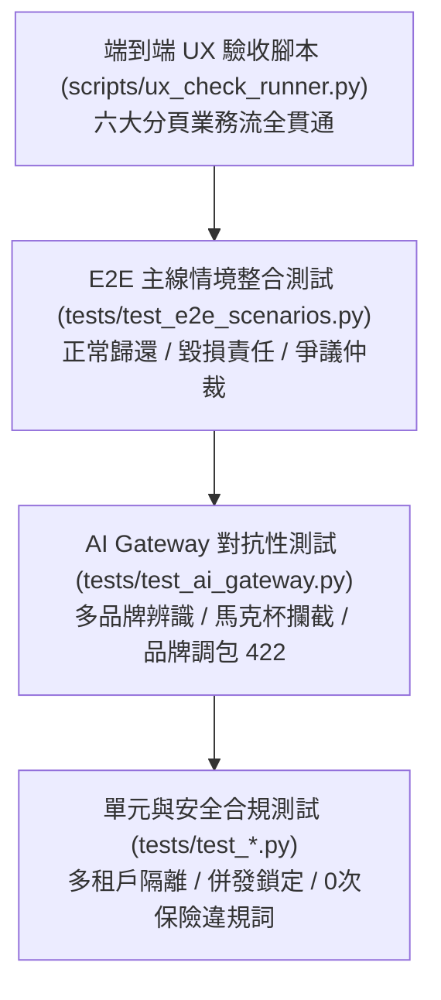

# LinLi Tool (鄰里工具) - 網頁與系統測試規範 (Web & System Testing Guide)

本規範定義 LinLi Tool 之測試策略、自動化測試工具鏈、對抗性案例設計、測試資料隔離與驗收回歸標準。

---

## 一、 測試體系與覆蓋矩陣

系統採用四層立體測試體系，確保從底層單元演算法至頂層端到端 UX 流程均具備 100% 驗證覆蓋：



### 測試模組劃分清單 (51 項 Pytest 測試)
1. `tests/test_ai_gateway.py`：A2 情境推薦、D1 無自動定價防呆、多品牌電鑽辨識、品項一致性、馬克杯雜物阻斷、跨品牌調包阻斷。
2. `tests/test_auth.py`：手機驗證碼 OTP、速率限制、身分設定檔讀寫。
3. `tests/test_communities.py`：社區冷啟動、住戶加入與多租戶邊界。
4. `tests/test_orders.py`：預授權計算、禁止自租、並發檔期排他鎖定 (409)、互助保障池提撥。
5. `tests/test_handover_disputes.py`：動態 TOTP 見面核銷、Check-in SHA-256 存證、Check-out 差分結案、爭議工單立案與覆核。
6. `tests/test_security_and_compliance.py`：SQLi / XSS 防禦、IDOR 越權防護、金融特許違規詞 0 次過濾。

---

## 二、 常用測試執行指令 (Test Commands)

### 1. 後端全套回歸測試 (Pytest)
```powershell
pytest tests -v
```
- **通過標準**：51 / 51 項全數 PASSED，耗時通常在 2 秒以內。

### 2. 前端型別檢查與生產打包
```powershell
cd frontend
npm run build
```
- **通過標準**：TypeScript 0 錯誤，Vite 打包無 Chunk 異常。

### 3. 全系統端到端 UX 檢核腳本 (UX-Check Runner)
```powershell
$env:PYTHONPATH = '.'
python scripts/ux_check_runner.py
```
- **通過標準**：六大核心分頁步驟均輸出 `[PASS]`，無 HTTP 429 或 409 阻斷。

---

## 三、 對抗性測試設計原則 (Adversarial Testing)

所有 Vision AI 相關功能必須通過以下對抗性壓力測試：

1. **非關生活雜物注入 (Out-of-Domain Injection)**：
   - 上傳咖啡馬克杯、文具等圖片。
   - **預期結果**：第一道門禁即刻判定 `INVALID_OBJECT`，拋出 HTTP 422，禁止進入差分計算。
2. **同品類跨品牌調包測試 (Cross-Brand Swap)**：
   - 借出登記為 Bosch 電鑽，取件或歸還時上傳牧田 Makita 或得偉 DeWalt 電鑽。
   - **預期結果**：第一道門禁即刻判定 `TOOL_SWAP_DETECTED`，拋出 HTTP 422，清空存證雜湊。
3. **無效廢照過濾測試 (Garbage Input)**：
   - 上傳全黑、全白或高度模糊失焦照片。
   - **預期結果**：Tier 1 本機 0-Token 快速攔截，提示重新拍攝對焦。

---

## 四、 測試資料隔離與防撞車規範 (Test Isolation)

1. **AI Gateway Rate Limit 防撞**：
   - 後端對單一用戶實施每分鐘 5 次 AI 呼叫限制。
   - 自動化測試腳本應採用動態 User ID（如 `base_id = 3000 + int(time.time()) % 10000`）進行測試分流，避免連續執行遭遇 HTTP 429。
2. **訂單衝突清理**：
   - 測試前先清理資料庫殘留的 `DisputeTicket` 與 `Order`，確保測試檔期排他鎖定正常運作。
