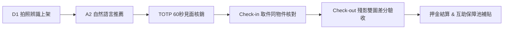

# 🛠️ LinLi Tool (鄰里工具) - 社區閒置工具共享與維護平台

[](https://www.python.org/)
[](https://fastapi.tiangolo.com/)
[](https://react.dev/)
[](https://www.typescriptlang.org/)
[](https://tailwindcss.com/)
[](https://ai.google.dev/)
[-success.svg)](./tests)
[](#六主管機關金融微文案合規原則)

> **都會社區閒置工具活化、見面安全交接、多模態 Vision AI 雙階段驗收與社區互助保障池機制的一站式解決方案。**

---

## 📖 專案背景與痛點解決

在都會集合式住宅中，居家修繕工具（如衝擊震動電鑽、高壓清洗機、多功能折疊鋁梯等）具備「**單價高、使用頻率低、存放佔空間**」之特徵。傳統鄰里共享面臨三大核心障礙：
1. **害怕工具遭掉包**：出借高階電鑽（如 Bosch），歸還時遭替換為雜牌或不同規格工具。
2. **損壞責任難釐清**：取件時未存證，歸還時出借人發現破損引發爭議，造成鄰里失和。
3. **租借流程耗時繁瑣**：缺乏安全便捷的核銷手段與合理的損壞補貼緩衝機制。

**LinLi Tool (鄰里工具)** 結合 **Gemini Vision 多模態視覺辨識**、**TOTP 60 秒動態見面交接**、**雙階段驗收門禁** 與 **社區互助保障池**，打造具備法律存證等級的鄰里互助平台。

---

## 🌟 五大核心技術亮點



### 1. Vision AI 雙階段驗收門禁法則 (Two-Stage Inspection Gate)
- **第一道門禁（輸入有效性與同實體檢核）**：
  - **非關物品立即攔截 (`INVALID_OBJECT`)**：上傳生活雜物（馬克杯、文具、餐具等非工程工具），系統即時攔截並拋出 HTTP 422，前端鎖定訂單與結算。
  - **同類跨品牌調包攔截 (`TOOL_SWAP_DETECTED`)**：即使借出與歸還皆為電鑽，若品牌銘牌或外觀不符（如出借 Bosch 歸還 Makita），精準判定為調包並即刻阻斷。
- **第二道門禁（差分損壞與責任計算）**：
  - 通過第一道門禁確認為同物件後，才對比施工磨損（MATCH 正常損耗退全額押金、MINOR_DIFF 表面刮傷扣 30%、DAMAGE_DETECTED 結構破損扣 100%）。

### 2. 45 度角引導與 258 Token 極致成本優化
- **拍攝角度指引**：全流程統一指引「**45 度側身特寫，露出品牌 LOGO 與夾頭銘牌**」，單張相片同時滿足防調包與功能結構檢驗，免除多角度補拍。
- **四層 Token 防線**：
  - **Tier 0（前端 Canvas 邊緣壓縮）**：最長邊等比縮放至 768px、JPEG 85%，將每次多模態呼叫鎖定在 **1 個 Tile (258 Tokens，節省 93% 頻寬與費用)**。
  - **Tier 1（後端 0-Token 秒判）**：以 Pillow 抽樣分析解析度與明暗度，0 Token 本機秒判過暗/全黑/空白廢照。
  - **Tier 2（極簡 JSON Schema）**：嚴格限制輸出在 80 Tokens 內。
  - **Tier 3（SHA-256 快取網關）**：以 `SHA256(image + prompt)` 命中快取直接 0 Token 回傳。

### 3. TOTP 動態取件碼與 Check-in 存證防竄改
- 借用人手機生成 **60 秒動態 6 碼 TOTP 碼**，出借人當面驗證核銷，徹底杜絕遠端幽靈取件。
- 現場取件拍照即時生成 **SHA-256 存證雜湊 (Digital Checksum)**，並與出借人原始相片特徵核對吻合後，訂單方推進至使用中 (`IN_USE`)。

### 4. 社區互助保障池機制 (Mutual Protection Pool)
- 平台不設特許保險，而是以每筆訂單內含 **5% 維護保障金** 注資社區公庫保障池。
- 住戶享有**信用分階梯折抵**（80~100 分享 50%~100% 押金豁免）。
- 工具若不幸毀損且扣抵押金不足以支應維修時，由社區互助保障池啟動最高 70% 之**責任補貼**。

### 5. 主管機關金融微文案嚴格合規 (Zero Forbidden Words)
- 全站 UI 介面、提示詞、RAG 知識庫與後端回傳，嚴格落實 **0 次保險違規詞**：
  - ❌ 禁用：`保險`、`保費`、`理賠`
  - ✅ 統一合規詞：`互助保障池`、`預授權押金 / 維護保障金`、`責任補貼 / 損害補償`

---

## 🏗️ 系統架構與技術棧

```
┌─────────────────────────────────────────────────────────────┐
│                      前端 (React 18 + TS)                    │
│   Tailwind CSS / Lucide Icons / HTML5 Canvas Tier-0 壓縮     │
│   Ghost Overlay 殘影取景框 / 信用分階梯面板 / 狸利吉祥物指引  │
└──────────────────────────────┬──────────────────────────────┘
                               │ HTTP / RESTful (Fetch API)
┌──────────────────────────────▼──────────────────────────────┐
│                    後端 (FastAPI + Python 3.13)              │
│  - Routers: Auth / Communities / Items / Orders / Disputes  │
│  - Services: HandoverService (TOTP) / OrderService / RAG    │
│  - Database: SQLAlchemy ORM + SQLite (linli_tool.db)        │
└──────────────────────────────┬──────────────────────────────┘
                               │
┌──────────────────────────────▼──────────────────────────────┐
│                    AI Gateway (智能網關)                     │
│  - Gemini Vision Client (多模態特徵差分 & 品項一致性)        │
│  - Pillow Tier-1 0-Token 秒判過濾器                         │
│  - SHA-256 Cache Manager (24h 特徵快取)                     │
│  - Local RAG Knowledge Base (SPEC_04 損壞判定與 FAQ 檢索)   │
└─────────────────────────────────────────────────────────────┘
```

---

## 🚀 快速啟動指引

### 1. 環境需求
- **Python**: 3.10+ (推薦 Python 3.13)
- **Node.js**: 18.0+ (推薦 Node.js 20+)
- **OS**: Windows / macOS / Linux

---

### 2. 後端啟動 (FastAPI)

```bash
# 1. 進入專案根目錄
cd linli-tool-project

# 2. 安裝 Python 相依套件
pip install -r backend/requirements.txt  # 或安裝 fastapi uvicorn sqlalchemy pillow pytest anyio

# 3. 啟動後端服務 (Windows PowerShell)
powershell -ExecutionPolicy Bypass -File scripts/start_server.ps1

# 或使用通用 Python 指令啟動：
python -m uvicorn backend.main:app --reload --host 127.0.0.1 --port 8000
```

> **API 互動式文件 (Swagger UI)**: [http://127.0.0.1:8000/docs](http://127.0.0.1:8000/docs)

---

### 3. 前端啟動 (React + Vite)

```bash
# 1. 進入前端目錄
cd frontend

# 2. 安裝相依套件
npm install

# 3. 啟動 Vite 開發伺服器
npm run dev
```

> **前端應用網址**: [http://localhost:3000](http://localhost:3000)

---

## 🧪 自動化測試全覆蓋 (51/51 Tests Passing)

專案內建完整的單元測試、AI Gateway 整合測試、合規性測試與端到端場景回歸：

```bash
# 於專案根目錄執行 pytest
pytest tests -v
```

### 測試覆蓋清單 (節錄)
- ✅ `test_a2_scenario_recommendation_and_fallbacks`：自然語言情境修繕標籤推薦與平滑降級。
- ✅ `test_d1_tool_image_recognition_and_price_omission`：D1 工具拍照辨識與嚴禁自動定價檢核。
- ✅ `test_tool_consistency_verification`：品名文字與上架相片一致性檢驗。
- ✅ `test_multi_brand_drill_recognition_and_consistency`：四大品牌電鑽（Bosch、Makita、DeWalt、Milwaukee）高精度辨識。
- ✅ `test_same_object_cross_brand_swap_prevention`：Check-in 取件同類跨品牌調包攔截。
- ✅ `test_checkout_unrelated_image_and_tool_swap_rejection`：歸還 Check-out 第一道門禁阻斷非工具（馬克杯）與調包。
- ✅ `test_items_verify_same_object_endpoint`：現場取件同物件專屬端點檢核。
- ✅ `test_strict_forbidden_insurance_words_compliance`：全站 0 次保險違規詞金融合規性測試。

---

## 📂 專案目錄結構

```text
linli-tool-project/
├── .agents/                      # Antigravity 專案設定、規則與工作流
│   ├── rules/
│   │   └── docs-writing.md       # 文檔撰寫與金融合規規範
│   └── workflows/
│       └── ux-check.md           # 前端介面與用戶體驗驗核工作流
├── AGENTS.md                     # 專案級架構守則 (兩階段門禁、Fail-Closed)
├── README.md                     # 專案總覽說明 (本文件)
├── backend/                      # FastAPI 後端模組
│   ├── ai/                       # AI Gateway 網關與 Gemini 整合
│   │   ├── gateway.py            # AI 閘道核心 (Token 壓縮、快取、門禁管理)
│   │   ├── gemini_client.py      # 多模態 Gemini Vision 整合與本機 Mock
│   │   └── prompts.py            # 繁體中文結構化系統提示詞
│   ├── knowledge_base/           # 本地 RAG 工具標準庫
│   │   └── knowledge_base.json   # 五大示範工具與 SPEC_04 損壞標準
│   ├── routers/                  # RESTful API 端點
│   │   ├── auth.py               # 手機 OTP 驗證與住戶身分
│   │   ├── communities.py        # 社區冷啟動與邀請碼
│   │   ├── items.py              # 工具 CRUD、拍照辨識與同物件檢驗
│   │   ├── orders.py             # 訂單試算、TOTP 取件核銷、歸還差分比對
│   │   └── rag.py                # 情境推薦與常見問答 (FAQ)
│   ├── services/                 # 業務邏輯服務層
│   │   ├── handover_service.py   # TOTP 驗證與 Check-in 存證
│   │   ├── item_service.py       # 工具資料處理
│   │   ├── order_service.py      # 費用試算、押金鎖定與保障池計算
│   │   └── rag_local_service.py  # 本地 TF-IDF 語意檢索
│   ├── database.py               # SQLite 連線與 Session 管理
│   ├── models.py                 # SQLAlchemy 資料庫模型
│   ├── schemas.py                # Pydantic v2 輸入輸出資料契約
│   └── main.py                   # FastAPI 應用入口與中介層設定
├── frontend/                     # React + TypeScript 前端模組
│   ├── public/test_assets/       # 實拍測試圖片庫 (Bosch、牧田、得偉、馬克杯)
│   ├── src/
│   │   ├── components/           # UI 元件 (GhostOverlayViewfinder, Mascot 等)
│   │   ├── services/             # 前端 API 客戶端與 Vision AI 邊緣壓縮
│   │   ├── types/                # TypeScript 介面定義
│   │   └── App.tsx               # 核心六大功能分頁互動主介面
│   ├── package.json              # 前端相依套件設定
│   └── vite.config.ts            # Vite 建置設定
├── scripts/                      # 開發與展示輔助腳本
│   ├── run_e2e_demo.py           # 端到端業務情境自動化展示腳本
│   ├── start_server.ps1          # Windows 一鍵啟動腳本
│   └── start_server.sh           # Linux / macOS 一鍵啟動腳本
└── tests/                        # 51 項全自動化測試套件
```

---

## 📜 授權條款

本專案採用 **MIT License** 授權開源。歡迎社區、物業管理單位與開發團隊自由使用、修改與部署。
