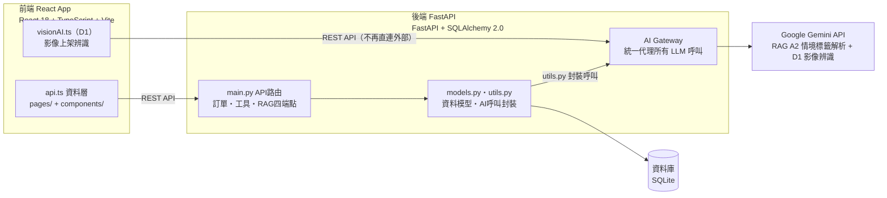
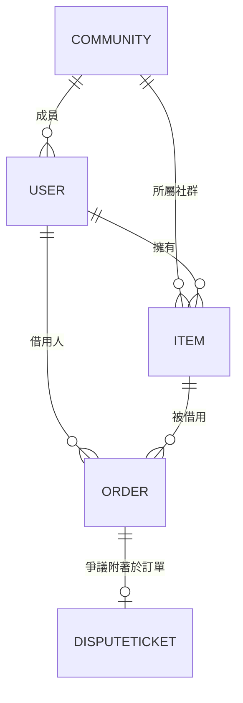

# LinLi Tool 前後端架構圖（重新規劃版）

所屬專案：LinLi Tool 鄰里工具
基準文件：PROJECT.md v1.2 第 3 節「專案結構」、第 10 節「安全與限制」
版本：v3.0（補上後端拆分結構、ERD、認證/rate limiting/測試/secrets 方案）

---

## 架構圖



---

## 模組對照

### 前端（React App）

| 模組 | 對應檔案 | 說明 |
|---|---|---|
| 頁面與元件 | `pages/`、`components/` | 22 個畫面 |
| 資料層 | `services/api.ts` | 呼叫後端 REST API |
| D1 上架辨識 | `services/visionAI.ts` | 影像辨識前端呼叫點，改走後端 API Gateway，不再直連外部 LLM |

### 後端（FastAPI）

| 模組 | 對應檔案 | 說明 |
|---|---|---|
| API 路由 | `main.py` | RAG 四端點、訂單、工具查詢 |
| 資料模型 | `models.py` / `schemas.py` | Community/User/Item/Order/DisputeTicket 五張核心表 |
| AI 呼叫封裝 | `utils.py` | 統一封裝 Gemini 呼叫（RAG 情境標籤解析 + D1 影像辨識） |
| 資料庫 | `database.py` | SQLite |

---

## 已定案項目

1. **AI 呼叫入口收斂為 Gemini API**：D1 影像辨識與 RAG 情境標籤解析統一改用 Gemini，兩者都經後端 AI Gateway 代理，金鑰只存後端環境變數，前端不再直連任何外部 LLM。單一供應商也代表 `utils.py` 只需維護一套 client 封裝。
2. **資料庫維持 SQLite**：不採用 PostgreSQL，維持現有 `database.py` 的 SQLite 方案。
3. **資料模型關聯明確化**：Community/User/Item/Order/DisputeTicket 的歸屬與關聯定義如下方 ERD。

---

## 後端拆分結構（main.py 拆分執行方案）

```
backend/
├── main.py                  # 僅掛載路由，不含商業邏輯
├── database.py               # SQLite 連線與 session
├── models.py / schemas.py    # ORM 模型與 Pydantic schema
├── routers/
│   ├── orders.py              # 訂單相關端點
│   ├── items.py                # 工具查詢/上架端點
│   ├── rag.py                    # RAG 四端點
│   └── users.py                 # 使用者/認證端點
├── services/
│   ├── order_service.py         # 訂單商業邏輯
│   ├── item_service.py           # 工具商業邏輯
│   └── dispute_service.py        # 爭議處理邏輯
└── ai/
    ├── gemini_client.py           # 統一 Gemini client 封裝
    └── gateway.py                   # AI Gateway：金鑰管理、呼叫代理、rate limit 掛點
```

router 只做輸入驗證與呼叫對應 service；service 只做商業邏輯，不直接碰 ORM；ORM 存取集中在 service 內呼叫 `models.py` 的 repository 層（若後續邏輯變複雜，可再拆出 `repositories/`）。

---

## 資料模型 ERD



假設：Item 掛在 Community 底下（同社群內互借），DisputeTicket 綁定 Order（而非直接綁 Item），因為爭議通常源於一次借還交易。如果實務上也需要「未成立訂單前的物品狀態爭議」，DisputeTicket 需要改成可選擇性綁 Item 或 Order，屆時再調整。

---

## 認證、Rate Limiting、測試、Secrets 管理方案

| 項目 | 建議做法 |
|---|---|
| 使用者認證 | FastAPI 內建 OAuth2PasswordBearer + JWT，`users.py` router 處理登入/註冊，`ai/gateway.py` 與各 service 用 dependency injection 驗證 token |
| API Rate Limiting | 在 AI Gateway 這層優先套用（因為 Gemini 呼叫有成本），可用 `slowapi`（FastAPI 中介層）依 user_id 限流；一般 CRUD 端點視流量再決定是否需要 |
| 測試 | `pytest` + `httpx.AsyncClient` 對 routers 做整合測試；service 層可單獨做單元測試，AI Gateway 呼叫用 mock 避免真的打 Gemini API |
| CI | GitHub Actions：push 時跑 pytest，之後可加 lint（ruff）與型別檢查（mypy） |
| Secrets 管理 | 開發階段用 `.env`（`python-dotenv`，不進版控）；上線後視部署環境（若上雲）再改用該平台的 Secret Manager |

---

## 待決議題

* RAG 向量檢索方案是否需要規劃（取決於「找附近閒置工具」的語意搜尋需求是否要做，目前尚未決定）

---

## Changelog

* v1.0：依 PROJECT.md v1.2 現況彙整前後端架構圖，標註 D1 BYOK 風險路徑
* v2.0：移除完成度標記，新增優化建議與待決議題，供前後端重新規劃使用
* v2.1：定案 AI 呼叫全數收斂至 Gemini、資料庫維持 SQLite、採納資料模型 ERD 建議
* v3.0：執行剩餘優化建議 — 補上後端拆分結構、ERD、認證/rate limiting/測試/secrets 管理方案
