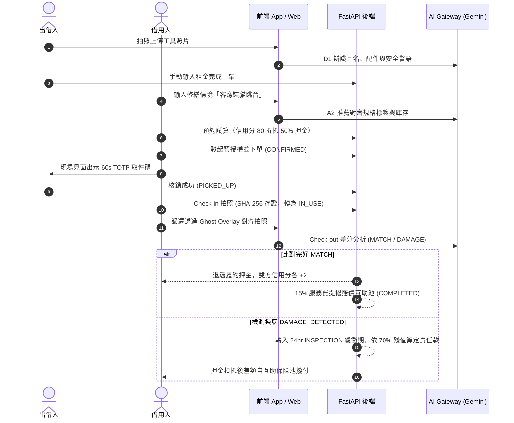

# LinLi Tool（鄰里工具）— 競賽展示簡報與評審 Demo 提案

> **提案團隊**：LinLi Lab（鄰裡實驗室）  
> **專案定位**：經理人 AI PM 班 Taipei Cohort 2 競賽專題  
> **產品 Slogan**：社區設備共享，鄰里互助好生活  
> **吉祥物造型**：狸利（LiLi）海狸工程師造型（熱情鄰家、注重安全、值得信任）

---

## 📑 簡報大綱（15 頁 Pitch Deck 架構）

- **Slide 1**：封面與品牌核心概述 (Cover & Brand Identity)
- **Slide 2**：痛點洞察：都市生活中的「工具閒置與互信赤字」 (Problem Statement)
- **Slide 3**：市場規模與目標族群 (TAM / SAM / SOM & Persona)
- **Slide 4**：LinLi Tool 核心解方與價值主張 (Solution & Value Proposition)
- **Slide 5**：品牌 IP 賦能：海狸狸利 (LiLi) 的 4 大角色體驗 (Brand & Mascot)
- **Slide 6**：全鏈路閉環使用者旅程 (End-to-End User Journey)
- **Slide 7**：AI 雙引擎之一：D1 工具拍照辨識上架（防詐誘導護城河）
- **Slide 8**：AI 雙引擎之二：A2 自然語言情境檢索與本地 RAG（<50ms 低延遲）
- **Slide 9**：AI 雙引擎之三：Ghost Overlay 雙圖容損差分比對與 35% 半透明導引
- **Slide 10**：雙重信任防護鏈：60 秒動態 TOTP 取件碼 + Check-in SHA-256 存證
- **Slide 11**：法律與財務創新：平台損壞互助保障池機制（非特許金融創新）
- **Slide 12**：商業模式與單位經濟學 (Business Model & Unit Economics)
- **Slide 13**：競爭態勢與差異化矩陣 (Competitive Matrix)
- **Slide 14**：發展路線圖與階段里程碑 (Roadmap & Milestones)
- **Slide 15**：評審 5 分鐘現場 Live Demo 演練腳本 (Live Demo Script)

---

## Slide 1：封面與品牌核心概述

### 投影片內容
* **主標題**：LinLi Tool（鄰里工具）
* **副標題**：以多模態 Vision AI 與社交擔保打造的「去中心化高信任社區工具共享平台」
* **品牌色彩**：MR. DIY 活力鮮黃 (`#FACC15`) × 工業高對比碳黑 (`#1E293B`)
* **核心標章**：海狸工程師「狸利 (LiLi)」
* **演講人**：LinLi Lab 產品經理小組（Taipei Cohort 2）

> **講者備忘 (Speaker Notes)**：  
> 「各位評審老師、同學大家好，我們是 LinLi Lab。今天為大家帶來的專案是『LinLi Tool 鄰里工具』。我們致力於運用多模態 AI 與社區社交擔保，打破現代公寓大樓冰冷的防盜門，讓閒置的昂貴設備在鄰里間高效、安全地流轉。」

---

## Slide 2：痛點洞察：都市生活中的「工具閒置與互信赤字」

### 投影片內容
1. **持有成本極高，使用率極低**：
   - 一把家用衝擊電鑽均價 NT$ 3,000 ~ 5,000，但在一般家庭的終身實際運轉時間**平均只有 13 分鐘**。
   - 買了佔收納空間、電池容易老化放電壞死；不買又無法解決急迫修繕需求。
2. **傳統租借門檻高**：
   - 特力屋等實體門市距離遠、需押證件、營業時間受限，且日租金與全額押金壓力大。
3. **鄰里出借三大心理恐懼**：
   - 🔴 **怕弄壞沒得賠**（無客觀檢驗依據，出借後求償無門）。
   - 🔴 **怕人品不好不還**（缺乏管委會或鄰里認證）。
   - 🔴 **怕隱私曝光**（拍照上傳家中背景暴露住宅格局與財物）。

> **講者備忘 (Speaker Notes)**：  
> 「現代都市不是沒有工具，而是『你的工具鎖在陽台，鄰居的層板掉在客廳』。出借人怕損壞、承租人怕被敲竹槓、陌生人之間缺乏信任。這就是 LinLi Tool 要用產品與 AI 技術解決的硬痛點。」

---

## Slide 3：市場規模與目標族群

### 投影片內容
* **TAM（台灣全體都會家庭）**：約 900 萬戶，家庭五金修繕市場規模逾 450 億新台幣。
* **SAM（六都具管委會之集合住宅社區）**：約 45,000 個獨立管委會大樓社區，潛在覆蓋約 320 萬戶家庭。
* **SOM（先期雙北核心示範社區）**：雙北中大型集合住宅大樓（300 戶以上社區 500 個），首年目標 150 個社區導入。
* **目標使用者畫像 (Persona)**：
  - **Persona A（修繕自造者．大華 32歲）**：租屋或新成屋住戶，假日偶爾組裝家具、裝貓跳台，不願花數千元買只用一次的大型工具。
  - **Persona B（閒置出借人．小陳 42歲）**：愛好 DIY 與露營，家有整套高階工具（高壓清洗機、震動電鑽），樂意藉出借賺取零用補貼並結交好鄰居。

---

## Slide 4：LinLi Tool 核心解方與價值主張

### 投影片內容
| 傳統實體門市租借 | 線上拍賣/Facebook 社團 | LinLi Tool 鄰里工具 |
| :--- | :--- | :--- |
| ❌ 需開車往返實體店面 | ❌ 面交地點不可控、陌生人風險 | ✅ **不出社區大廳即可電梯面交** |
| ❌ 信用卡全額扣抵高額押金 | ❌ 缺乏合約保障，損壞各執一詞 | ✅ **信用分折抵押金（最高 100% 免押）** |
| ❌ 人工紙本登記、外觀難比對 | ❌ 無標準檢查流程 | ✅ **Gemini Vision 雙圖差分驗退** |
| ❌ 損壞賠償爭議頻傳 | ❌ 無賠償機制，自認倒楣 | ✅ **「平台損壞互助保障池」差額補貼** |

---

## Slide 5：品牌 IP 賦能：海狸狸利 (LiLi) 的 4 大角色體驗

### 投影片內容
* **吉祥物設計理念**：北美海狸（天然工程師，擅長利用工具築壩），頭戴黃色安全帽、身揹工具帶。
* **4 大角色融入核心流程**：
  1. 🦫 **迎賓導覽狸利 (Friendly Greeter)**：於首頁與 A2 推薦引導鄰居發掘工具、親切解答居家修繕。
  2. 🦫 **AI 相機助手狸利 (Vigilant Inspector)**：引導 4:3 鮮黃虛線對齊、自動提醒隱私遮蔽、防晃重拍提示。
  3. 🦫 **信用守護狸利 (Trust Guardian)**：即時解說三級距信用分折抵、防扣款恐慌心理安撫。
  4. 🦫 **物業值班狸利 (Property Attendant)**：常駐爭議工單與管理中心，在損壞審核期協助客觀判定。

---

## Slide 6：全鏈路閉環使用者旅程



---

## Slide 7：AI 核心技術之一：D1 工具拍照辨識上架

### 投影片內容
* **問題**：長輩或非專業鄰居不會寫工具規格、漏寫配件型號、不知該提示何種安全規範。
* **技術架構**：
  - 後端 FastAPI 代理呼叫 Google Gemini Vision 多模態分析。
  - Prompt 強制固化 System Prompts，輸出結構化 JSON（品名、類別、隨附配件、操作安全警語）。
* **關鍵技術護城河（防誘導定價機制）**：
  - **嚴格合規規範**：Prompt 明文禁止預估市價或建議租金；AI Gateway 後端會進一步攔截並抹除任何價格欄位。
  - **理由**：避免 AI 低估或高估引發出借人被誤導、定價爭議或誘發詐欺。定價權 100% 回歸出借住戶。

---

## Slide 8：AI 核心技術之二：A2 自然語言情境檢索與本地 RAG

### 投影片內容
* **問題**：使用者只知道「我想解決什麼修繕問題」（例如「客廳水泥牆裝層板」），不知道該借電鑽、衝擊鑽、還是旋轉槌，也不知道需要搭配幾號鑽尾。
* **技術架構**：
  1. **雲端 Gemini 意圖對齊**：將非結構化問題轉譯為受控標籤（如 `['衝擊電鑽', '水泥鑽頭', '壁虎螺絲', '水平儀']`）。
  2. **本地 TF-IDF + BM25 RAG 檢索**：
     - 社區工具庫與常見問答直接在本地記憶體進行向量/詞頻檢索。
     - **延遲 < 50ms**，大幅節省 LLM Token 費用並保證離線可用。
  3. **4 大降級容錯架構**：
     - 斷線/逾時 $\rightarrow$ 降級至 SQL 關鍵字模糊檢索。
     - 有標籤無庫存 $\rightarrow$ 回傳周邊示範工具與採購建議。
     - JSON 解析異常 $\rightarrow$ 正則表達式字詞萃取保底。
     - 政治/非修繕無關問題 $\rightarrow$ 狸利親切拒答。

---

## Slide 9：AI 核心技術之三：Ghost Overlay 雙圖容損差分比對

### 投影片內容
* **4:3 鮮黃虛線相機視窗 (`GhostOverlayViewfinder.tsx`)**：
  - 借用人歸還拍攝時，半透明疊加（Opacity 0.35）取件時所拍攝的 Check-in 照片，引導角度與輪廓百分之百重合。
* **寬容損耗標準 (Tolerance Algorithm)**：
  - 嚴格指令 Gemini Vision 區分「功能性結構損害」與「正常使用耗損」。
  - 表面微幅灰塵、正常木屑、施工水漬、細微握把擦痕，**強制判定為 MATCH**。
  - 僅在外殼碎裂、配件遺失、馬達燒焦、結構扭曲時判定為 `DAMAGE_DETECTED`。
* **低信心度重拍保護**：
  - 若照片對焦模糊或手震導致 Confidence $< 0.60$，後端拋出 `422 IMAGE_TOO_BLURRY`，由相機助手狸利提示重拍，絕不草率扣款。

---

## Slide 10：雙重信任防護鏈：60 秒動態 TOTP 取件碼 + Check-in SHA-256 存證

### 投影片內容
* **痛點**：雙方見面借還時，口頭確認容易賴帳；或是事後聲稱「我沒拿到工具」。
* **防護機制 1：60 秒輪替 TOTP 動態核銷碼**：
  - 借用人手機畫面上顯示 6 碼動態碼與倒數計時器。
  - 出借人輸入系統即刻核銷，狀態正式變更為 `PICKED_UP`。
  - 杜絕截圖轉傳冒領；提供前一窗口 60 秒緩衝容錯。
* **防護機制 2：Check-in SHA-256 數位指紋雜湊存證**：
  - 取件後現場拍攝初始工具照片，後端計算不可竄改的 SHA-256 雜湊碼存入 DB。
  - 作為歸還時 AI 差分對比的黃金基準線 (Golden Baseline)，防範「移花接木」糾紛。

---

## Slide 11：法律與財務創新：平台損壞互助保障池機制

### 投影片內容
* **法規合規護城河 (PRD 6.3 嚴格規範)**：
  - 平台絕非保險公司，無特許金融執照。全站 UI 與 API **全面禁絕「保險」、「保費」、「理賠」等金融保險字眼**。
  - 定位為**「社區設備維護互助儲備基金 (Mutual Compensation Pool)」**。
* **賠償計算核心公式**：
  $$\text{殘值 (Residual Value)} = \text{原價 (Market Value)} \times 70\%$$
  $$\text{損壞責任款 (Liability)} = \text{殘值} \times \text{損壞比率 (MINOR: 30\%, DAMAGE: 100\%)}$$
* **示範工具 vs 純押金制分流**：
  - **5 項示範工具**：享有互助池差額補貼（借用人自付實繳押金，不足差額由互助池補貼出借人）。
  - **非示範自訂工具**：回退 Option B 純押金制，保障池不予撥付，保障池餘額永不透支（保證 $\ge 0$）。
* **資金流入源頭**：每筆順利履約結案的訂單，自動提撥 **15% 平台服務費** 注入互助池。

---

## Slide 12：商業模式與單位經濟學

### 投影片內容
* **營收來源**：
  1. **平台交易服務費**：抽取總租金之 15%（主要轉化為互助保障池滾存基金）。
  2. **社區管委會 SaaS 訂閱費**：大型社區公設工具室管理系統月租費（NT$ 1,200/月）。
  3. **耗材與品牌導購**：電鑽鑽尾、砂紙、高壓清潔劑等耗材銷售分潤。
* **單位經濟學模型 (Unit Economics)**：
  - 平均每筆租借租期：2.5 天，客單價：NT$ 350。
  - 平台服務費收入：NT$ 52.5。
  - 壞損賠付率（根據社區社交擔保濾波後）：$< 1.8\%$。
  - 賠償池資金儲備比率：每 100 筆訂單累積注入 NT$ 5,250，足以覆蓋平均偶發損壞支出。

---

## Slide 13：競爭態勢與差異化矩陣

### 投影片內容
```
         ▲ 信任度與安全保障 (Trust & Protection)
         │
         │           ★ LinLi Tool（鄰里工具）
         │           (社交擔保 + 互助池 + Vision AI 差分)
         │
         │  特力屋門市租借
         │  (高押金、遠距離)
─────────┼────────────────────────► 便利度與就近性 (Proximity)
         │
         │           Facebook 社團 / 旋轉拍賣
         │           (無保障、面交摩擦大、各執一詞)
         │
         ▼
```
* **核心勝出關鍵**：
  1. **物理就近**：同一社區電梯上下樓 3 分鐘交接。
  2. **技術客觀**：雙圖差分取代口舌爭辯，寬容演算法杜絕過度索賠。
  3. **心理零負擔**：信用分半價/免押金 + 預授權防恐慌微文案。

---

## Slide 14：發展路線圖與階段里程碑

### 投影片內容
* **Stage 1（2026 Q1~Q2）核心驗證期（已達成）**：
  - 完成 Phase 0 ~ Phase 6 全功能開發與 44 項自動化測試驗證。
  - 建立 AI Gateway、TOTP 核銷、Ghost Overlay 差分引擎與互助保障池。
* **Stage 2（2026 Q3~Q4）社區試點試跑**：
  - 於雙北（新店陽光花園、文山綠意安居等 5 個示範社區）進行 Closed Beta 試跑。
  - 驗證損壞率與社交擔保邀請碼轉化率（目標驗證住戶逾 60%）。
* **Stage 3（2027 Q1~Q2）B2B2C 品牌商生態鏈**：
  - 與 Bosch、Karcher 等品牌原廠接軌，提供原廠保修耗材優惠與設備健康度物聯網升級。

---

## Slide 15：評審 5 分鐘現場 Live Demo 演練腳本

### 現場演練時序表（5 分鐘精華）

| 時間 | 操作流程 | 現場螢幕畫面 | 講者說明重點（逐字參考） |
| :--- | :--- | :--- | :--- |
| **00:00 - 00:45** | **社交擔保註冊與冷啟動** | 終端執行 `python scripts/run_e2e_demo.py` 或開啟前端首頁 | 「各位評審請看，出借人小陳建立陽光花園社區後，產生 HMAC 加密邀請碼。借用人大華持碼加入，免去繁瑣審核，由鄰里信用擔保直接升級為 VALIDATED 住戶。」 |
| **00:45 - 01:45** | **D1 拍照上架 & A2 自然語言修繕推薦** | 展示電鑽照片辨識、A2 情境標籤抽取 | 「大華想在客廳裝貓跳台，但不知道用什麼工具。AI 自動抽取『衝擊電鑽』與『水平儀』。而出借人在上架時，AI 自動辨識配件並生成安全警語，且**絕對不自動估價**，守護出借人定價權。」 |
| **01:45 - 02:30** | **金流預授權與信用分折抵** | 呈現 `PreAuthCard` 預授權卡片 | 「大華信用分 80 分，享有押金半價折抵！卡片清楚寫明『總租金 + 履約押金 = 授權總額』，絕無『立即扣款』等恐嚇用詞，消除租借心理門檻。」 |
| **02:30 - 03:30** | **TOTP 核銷取件 & Check-in SHA-256 存證** | 展示 6 碼動態碼倒數、Check-in 雜湊運算 | 「取件現場，大華出示每 60 秒輪替的動態 TOTP 碼，小陳輸入即刻確認；大華拍照留存初始狀態，後端產生 SHA-256 數位指紋，雙重鎖定履約事實。」 |
| **03:30 - 04:30** | **Ghost Overlay 歸還驗收 & 信用獎勵** | 4:3 黃框半透明舊照比對、MATCH 結案 | 「歸還時，相機半透明疊加取件舊照。微量灰塵被 AI 判定為正常耗損 MATCH！押金全額釋出，雙方信用分各 $+2$，並有 15% 服務費自動匯入損壞互助池。」 |
| **04:30 - 05:00** | **異常主線：破損補貼與 Q&A 結語** | 展示高壓清洗機破損 `DAMAGE_DETECTED` 與工單 | 「如果遇到噴槍斷裂，系統依 70% 殘值算定責任，差額由互助保障池承擔！萬一有爭議，工單凍結款項由管委會介入。LinLi Tool 讓都市工具流動起來，謝謝大家！」 |
