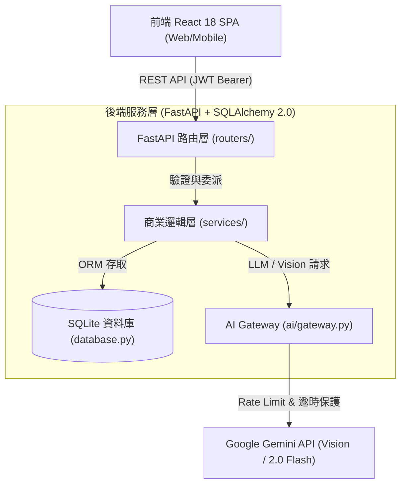
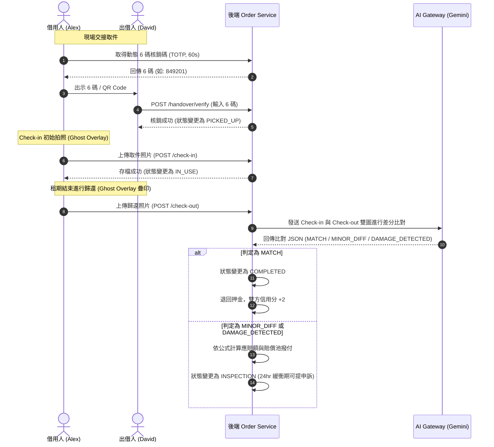

# LinLi Tool（鄰里工具）完整功能規格書 (Functional Specification Document)

- **文件名稱**：LinLi Tool 系統功能規格書
- **文件版本**：v1.2 (納入雙階段驗收門禁、棄單違約矩陣、保障池帳本與免責範圍)
- **基準文件**：
  - PRD: [linli-tool-prd.md](file:///c:/Users/derick.chung_cycraft/Downloads/AI_PM/project/linli-tool-project/linli-tool-prd.md)
  - 架構設計: [linli-tool-arch.md](file:///c:/Users/derick.chung_cycraft/Downloads/AI_PM/project/linli-tool-project/linli-tool-arch.md)
  - 設計指南: [design_guide.md](file:///c:/Users/derick.chung_cycraft/Downloads/AI_PM/project/linli-tool-project/design_guide.md) (品牌視覺與設計系統指南 v1.0)
- **更新日期**：2026-09-16
- **負責團隊**：LinLi Lab（鄰裡實驗室）

---

## 目錄

1. [系統總覽與模組劃分](#1-系統總覽與模組劃分)
2. [全域資料模型與關聯架構 (ERD)](#2-全域資料模型與關聯架構-erd)
3. [前端設計系統與品牌 UI 規範 (Design System & UI Tokens)](#3-前端設計系統與品牌-ui-規範-design-system--ui-tokens)
4. [模組一：會員認證、社區歸屬與社交擔保 (SPEC_01)](#4-模組一會員認證社區歸屬與社交擔保-spec_01)
5. [模組二：工具上架、影像辨識與情境搜尋 (SPEC_02)](#5-模組二工具上架影像辨識與情境搜尋-spec_02)
6. [模組三：租借預約、押金試算與賠償池機制 (SPEC_03)](#6-模組三租借預約押金試算與賠償池機制-spec_03)
7. [模組四：取件核銷、交接影像差分比對與爭議處理 (SPEC_04)](#7-模組四取件核銷交接影像差分比對與爭議處理-spec_04)
8. [模組五：RAG 智慧客服與裝備健康摘要 (RAG_SPEC)](#8-模組五rag-智慧客服與裝備健康摘要-rag_spec)
9. [AI Gateway 與外部 API 代理規範](#9-ai-gateway-與外部-api-代理規範)
10. [非功能需求、安全防禦與邊界控制](#10-非功能需求安全防禦與邊界控制)
11. [驗收標準與測試策略矩陣](#11-驗收標準與測試策略矩陣)

---

## 1. 系統總覽與模組劃分

### 1.1 系統目標
LinLi Tool 是一個專注於「低頻剛需居家修繕及露營工具」的社區共享平台（C2C / B2B2C）。
旨在解決三大痛點：
1. **閒置佔空間（74.1%）**：住戶工具買了用一兩次即閒置，缺乏安全的出借變現管道。
2. **損壞責任歸屬不清（55.2%）**：出借者擔心工具被弄壞刮傷，承租者擔心無辜背負巨額賠償。
3. **門檻過高（65.5%）**：傳統租賃動輒要求數千元高額全額押金，增加借用摩擦力。

本系統透過 **社交擔保網絡**、**信用分級免押金**、**後端代理之 Gemini Vision/RAG 智慧輔助** 及 **平台賠償池 (Compensation Pool)**，建立安全的社區閉環。

### 1.2 系統架構與責任邊界
對齊 `linli-tool-arch.md` v3.0：
* **前端 (Client App)**：React 18 + TypeScript + Vite + Tailwind CSS。負責展示 22 個畫面元件、狀態管理與表單輸入；不再直接直連任何第三方 LLM API（原 BYOK 改由後端代理）。
* **後端服務 (API Gateway & Backend)**：FastAPI + SQLAlchemy 2.0 + SQLite（`database.py`），拆分為 Router、Service、Repository 與 AI Gateway 四層架構。
* **AI 代理層 (AI Gateway)**：集中管理 Google Gemini API 金鑰、負責 Rate Limiting、重試降級與 Prompt 封裝。



---

## 2. 全域資料模型與關聯架構 (ERD)

### 2.1 資料實體關聯圖 (ERD)

```mermaid
erDiagram
    COMMUNITY ||--o{ USER : "包含 (members)"
    COMMUNITY ||--o{ ITEM : "所屬社群工具 (items)"
    USER ||--o{ ITEM : "上架擁有 (owner)"
    USER ||--o{ ORDER : "承租借用 (renter)"
    ITEM ||--o{ ORDER : "租借標的 (item)"
    ORDER ||--o| DISPUTE_TICKET : "產生爭議 (dispute)"
    ORDER ||--o{ COMPENSATION_LEDGER : "觸發保障金出入帳 (ledgers)"
    COMMUNITY ||--o{ COMMUNITY_INVITATION : "發行邀請 (invitations)"
    USER ||--o{ COMMUNITY_INVITATION : "由居民發起 (inviter)"

    COMMUNITY {
        int id PK
        string name "社區大樓名稱"
        string address "標準化地址"
        datetime created_at
    }

    USER {
        int id PK
        string phone UK "手機號碼"
        string name "稱呼"
        int community_id FK "所屬社區"
        string verification_status "VALIDATED / PENDING / REJECTED"
        int credit_score "信用分 (預設 80)"
        datetime created_at
    }

    COMMUNITY_INVITATION {
        int id PK
        string token UK "HMAC 簽章邀請碼"
        int inviter_user_id FK "邀請人"
        int community_id FK "目標社區"
        datetime expires_at "過期時間 (48hr)"
        boolean is_used "是否已核銷"
    }

    ITEM {
        int id PK
        int owner_id FK "持有者"
        int community_id FK "所在社區"
        string name "工具名稱"
        string category "分類 (POWER_TOOLS 等)"
        int daily_rate "每日租金 (TWD)"
        int market_value "購買原價/市值"
        string damage_tool_id "示範工具代碼 (可為 null)"
        string status "AVAILABLE / RENTED / MAINTENANCE"
        text accessories_json "配件清單 JSON"
        text safety_notes "安全注意事項"
        string image_url "工具代表圖"
        datetime created_at
    }

    ORDER {
        int id PK
        string order_no UK "訂單編號"
        int item_id FK "工具 ID"
        int renter_id FK "借用人 ID"
        int lender_id FK "出租人 ID"
        date start_date "起租日"
        date end_date "歸還日"
        int rent_days "租借天數"
        int daily_rate "當次每日租金"
        int total_rent "總租金"
        int base_deposit "基準押金 (15x)"
        int actual_deposit "實扣押金 (依信用分折抵)"
        string status "PENDING / CONFIRMED / PICKED_UP / IN_USE / INSPECTION / COMPLETED / CANCELLED / DISPUTED"
        string handover_code "動態 6 碼核銷碼"
        datetime handover_code_expires "核銷碼過期時間"
        string checkin_image_url "取件存證照片"
        string checkout_image_url "歸還存證照片"
        string vision_result "MATCH / MINOR_DIFF / DAMAGE_DETECTED / TOOL_SWAP_DETECTED / INVALID_OBJECT"
        int compensation_amount "應補償總額"
        int pool_payout "社區互助保障池支出金額"
        datetime created_at
    }

    DISPUTE_TICKET {
        int id PK
        int order_id FK UK "關聯訂單"
        int complainant_id FK "申訴人 ID"
        string reason "爭議原因說明"
        string status "OPEN / UNDER_REVIEW / RESOLVED / REJECTED"
        text evidence_photos "舉證照片 JSON"
        text resolution_notes "判決說明"
        datetime created_at
        datetime resolved_at
    }

    COMPENSATION_LEDGER {
        int id PK
        int order_id FK "關聯訂單"
        string transaction_type "FEE_INFLOW (15%入池) / DAMAGE_PAYOUT (責任補貼支出)"
        int amount "異動金額"
        int balance_after "異動後保障池水位"
        string notes "流水說明"
        datetime created_at
    }
```

---

## 3. 前端設計系統與品牌 UI 規範 (Design System & UI Tokens)

依據 [design_guide.md](file:///c:/Users/derick.chung_cycraft/Downloads/AI_PM/project/linli-tool-project/design_guide.md) v1.0 規範，全站視覺與前端元件庫採用 **MR. DIY 活力鮮黃 × 工業高對比現代質感**，並貫徹吉祥物「狸利 (LiLi)」的四大應用場景與嚴格的微文案原則。

### 3.1 吉祥物「狸利 (LiLi)」規格與場景角色映射
* **角色定位**：狸利 (LiLi) 海狸工程師，象徵「勤勞築巢、善用工具、嚴謹細緻、熱情鄰家」。2.5 頭身 Q 版造型，頭戴黃色工安安全帽（標有黑底黃字 LiLi 標章）、身著深灰工裝背心與雙門牙親切笑容。
* **系統四大場景角色**：
  1. **迎賓導覽 (Friendly Greeter)**：首頁 Banner、早安問候、功能導覽與各模組空狀態提示，降低工具修繕的硬核門檻。
  2. **AI 相機助手 (Vigilant Inspector)**：Check-in 初始存證與 Check-out 歸還差分相機取景介面，負責輔助對齊虛線框、光線補償與住宅隱私自動模糊去識別化。
  3. **信用守護者 (Trust Guardian)**：個人信用分數徽章模組、押金減免說明與平台損壞互助保障池，手持盾牌與維修工具象徵資產安全。
  4. **物業值班員 (Gatekeeper LiLi)**：大樓管理室物業端介面，協助保全人員執行配件清點與實體交接核銷。

### 3.2 顏色系統與 Design Tokens (Tailwind CSS)

| 類別 | 色彩名稱 | HEX Code | Tailwind Class / RGB | 核心用途 |
|---|---|---|---|---|
| **品牌主色** | DIY Vibrant Yellow | `#FFC801` | `bg-diyYellow-500` / `rgb(255, 200, 1)` | 品牌 Primary 按鈕、吉祥物帽子、主 Banner、重點 Highlight |
| **品牌主色** | Bright Gold (亮金黃) | `#FFD700` | `bg-diyYellow-400` / `rgb(255, 215, 0)` | Hover 狀態、黃色發光 Glow 效果、懸浮標章 |
| **品牌主色** | Dark Gold (深金黃) | `#E6A800` | `text-diyYellow-600` / `rgb(230, 168, 0)` | 深色背景上的文字、圖示主色、邊框聚焦線 |
| **品牌主色** | DIY Industrial Dark | `#1E1E24` | `bg-diyDark` / `rgb(30, 30, 36)` | 頁首 Global Header、手機模擬外框、高對比 Card 卡片 |
| **品牌主色** | Brand Jet Black (純粹黑) | `#18181B` | `bg-brandDark` / `rgb(24, 24, 27)` | 頁尾 Footer、Modal 遮罩底色、相機 Viewfinder 背景 |
| **狀態色** | Success Emerald | `#10B981` | `bg-emerald-500` | 工具「可立即借用」、押金「解鎖順利結案」、信用分加分 |
| **狀態色** | Warning Amber | `#D97706` | `bg-amber-600` | 「金額預授權鎖定中」、差分比對「微幅痕跡」、逾期提醒 |
| **狀態色** | Danger Ruby | `#EF4444` | `bg-red-500` | AI 檢測「新痕跡/刮傷」、帳號「停權」、爭議仲裁扣款 |
| **狀態色** | Info Sapphire | `#3B82F6` | `bg-blue-500` | 「品牌贊助」標籤、無接觸物業架位指引 (如 A-02 架) |
| **中性色** | App Canvas BG | `#F3F4F6` | `bg-gray-100` | 全站主要背景底色 (Light Mode Slate-100) |
| **中性色** | Card Surface White | `#FFFFFF` | `bg-white` | 主要卡片與表單元件背景色 |
| **中性色** | Muted Border Slate | `#E2E8F0` | `border-slate-200` | 卡片細線邊框與分隔線 |
| **中性色** | Subtle Text Slate | `#64748B` | `text-slate-500` | 次要說明文字、時間標籤、灰階輔助字 |
| **中性色** | Primary Text Charcoal | `#0F172A` | `text-slate-900` | 主要內文標題、高對比文字 |

### 3.3 Typography、圓角與光影階層
* **字型規範**：`font-family: 'Inter', 'Noto Sans TC', sans-serif;`
* **字級規範**：
  * `Display Header`: 24px / 1.5rem (Black 900) $\rightarrow$ `text-2xl font-black`
  * `H1 Title`: 20px / 1.25rem (Bold 700) $\rightarrow$ `text-xl font-bold`
  * `H2 Section Title`: 16px / 1.0rem (Bold 700) $\rightarrow$ `text-base font-bold`
  * `Body Primary`: 14px / 0.875rem (Regular 400 / Medium 500) $\rightarrow$ `text-sm font-normal`
  * `Body Secondary`: 12px / 0.75rem (Regular 400) $\rightarrow$ `text-xs text-gray-500`
  * `Micro Caption/Badge`: 10px / 0.625rem (Black 900 / Bold 700) $\rightarrow$ `text-[10px] font-bold`
* **圓角規格**：
  * 手機外層容器：`rounded-[28px]`
  * 卡片與主要 Modal：`rounded-2xl` (16px) 或 `rounded-3xl` (24px)
  * 按鈕與輸入框：`rounded-xl` (12px)
  * 標籤與狀態徽章：`rounded-full` (9999px)
* **品牌黃光特效 (Brand Glow)**：
  ```css
  .glow-yellow {
    box-shadow: 0 0 20px rgba(255, 200, 1, 0.4);
  }
  ```

### 3.4 四大核心 UI 元件庫語言 (Key UI Component Patterns)
1. **信用分數徽章 (Credit Score Badge)**：
   * 代碼樣式：`bg-diyDark text-white px-2.5 py-1 rounded-full text-xs font-bold border border-diyYellow-500`
   * 視覺呈象：深炭灰黑底膠囊，金黃色外框，左側搭配金黃盾牌圖示，數字高亮展示。
2. **主行動按鈕 (Primary CTA Button)**：
   * 代碼樣式：`bg-diyYellow-500 hover:bg-diyYellow-600 text-diyDark font-black py-3 px-4 rounded-xl shadow-md transition-all`
   * 視覺呈象：MR. DIY 鮮黃底色、深炭灰超粗體字、12px 圓角，Hover 微亮化與陰影抬升。
3. **Ghost Overlay 鏡頭比對視窗 (Camera Alignment Viewfinder)**：
   * 代碼樣式：深色 4:3 比例預覽框、鮮黃虛線對齊引導框 (`border-2 border-dashed border-diyYellow-500`)、Check-in 輪廓半透明層 (`opacity: 0.35`)。
   * 核心功能：Check-in 取件時以黃色虛線匡列工具核心主體；Check-out 歸還時半透明疊印取件照片，引導借用人從同角度、同焦距拍攝，確保影像差分比對準確率。
4. **金流預授權計算卡片 (Pre-authorization Breakdown Card)**：
   * 代碼樣式：淺黃底色 (`bg-amber-50`)，深黃細邊框 (`border-amber-200`)，`rounded-2xl`。
   * 核心功能：條列展示「租金 + 平台保障金 + 履約押金 = 授權總額」，清晰標記押金為暫扣預授權，消除金流恐懼。

### 3.5 品牌語調與微文案規範 (Voice, Tone & Microcopy)
* **三大原則**：
  1. **鄰家親切 (Neighborly & Approachable)**：使用「早安！」、「狸利提示」等溫暖字眼，降低居家修繕硬核感。
  2. **極致透明 (Radically Transparent)**：涉及扣款與押金時，明確標明「歸還無誤即放行預授權」，避免引發資金恐慌。
  3. **安全專業 (Safety & Reassuring)**：強調「平台安心保障金」、「3秒去識別化模糊」，彰顯科技與資產保障。
* **情境微文案標準與防呆對照表**：

| 情境 (Scenario) | 推薦標準微文案 (Recommended Microcopy) | 嚴格避免文案 (Anti-pattern) |
|---|---|---|
| **金流預授權** | 「發起預約並執行預授權鎖定 (歸還無誤即放行押金)」 | 「立即扣款 NT$ 732」 |
| **AI 相機拍攝** | 「請將工具置於引導框內，狸利會自動協助遮蔽住宅隱私」 | 「上傳照片進行掃描」 |
| **舊傷標註** | 「拍攝並標註初始舊傷，保護您的借用權益」 | 「舊傷免責聲明」 |
| **AI 檢測到異動** | 「檢測到表面有微幅痕跡 (Diff: 0.18)，是否需補充清潔照或說明？」 | 「檢測到損壞，準備扣除押金」 |

---

## 4. 模組一：會員認證、社區歸屬與社交擔保 (SPEC_01)

### 4.1 功能概述／目標
解決陌生人共享中的身分真實性與責任歸屬痛點（55.2% 最大疑慮）。使用者需以手機門號認證，並透過「既有住戶社交擔保邀請」或「首位居民建立社區」加入特定實名社區，以落實社區自治與資料隔離。同時維護個人「信用分（Credit Score）」，直接連結押金減免級距。

### 4.2 使用情境／使用者故事
* **US-01-A（新門號登入）**：身為住戶 Alex，我想輸入手機號碼並在手機收到 OTP 簡訊快速登入，無須記憶密碼。
* **US-01-B（受邀加入社區）**：身為新搬入大樓的住戶，我點擊鄰居發送的 LINE 邀請連結，驗證通過後立即獲得該大樓已認證居民資格。
* **US-01-C（冷啟動首位住戶）**：身為新大樓第一位住戶，我可以宣告成立新社區大樓，建立首個節點。

### 4.3 具體功能需求與商業規則
1. **手機門號與 OTP 登入**：
   - 支援台灣手機號碼格式（`^09\d{8}$`）。
   - 後端產生 6 碼純數字 OTP，存入 Cache 並設定 TTL = 180 秒。
   - 單一門號 24 小時內最多發送 5 次 OTP，連續輸錯 3 次則該驗證碼失效。
   - 驗證成功後，核發效期 7 天之 JWT Access Token（包含 `user_id`, `community_id`, `role`）。
2. **社交擔保與社區驗證機制**：
   - **情境 A（冷啟動新建社區）**：使用者填寫社區名稱與地址，系統建立社區，該使用者狀態設為 `VALIDATED`（創始管理住戶）。
   - **情境 B（憑邀請碼加入）**：既有 `VALIDATED` 住戶可產出具有 HMAC-SHA256 簽署之邀請 Token（效期 48 小時）。被邀請人註冊時帶入 Token，系統驗證簽名無誤且邀請人資格正常，被邀請人立即變更為 `VALIDATED`。
   - **情境 C（無擔保審核）**：若無邀請碼或邀請碼失效，使用者可選擇申請加入某社區，帳號狀態標記為 `PENDING`。未通過前僅能使用瀏覽功能，無法預約與上架。
3. **信用分級與動態調整**：
   - 用戶初始預設信用分為 **80 分**。
   - 成功完成一次租借（Check-out 判定 `MATCH`），借出方與借用方各增加 **+2 分**。
   - 若發生損壞且判定屬實，依程度扣 **-10 至 -20 分**；惡意侵占或違約不還扣 **-30 分** 並列入社區黑名單。
   - 信用分級對應押金減免規則：
     - **等級 A (≥ 100 分)**：免收押金（押金率 0%）。
     - **等級 B (80 ~ 99 分)**：押金半價（押金率 50%）。
     - **等級 C (< 80 分)**：全額押金（押金率 100%）。
4. **前端視覺與微文案規範 (SPEC_01 UI Integration)**：
   - **個人檔案頁面**：個人信用分數必須以 **信用分數徽章 (Credit Score Badge)** 呈現（`bg-diyDark text-white px-2.5 py-1 rounded-full text-xs font-bold border border-diyYellow-500`），並搭配「信用守護者 (Trust Guardian LiLi)」圖示，清晰說明當前押金減免等級。
   - **登入與受邀加入頁面**：採用「迎賓導覽 (Friendly Greeter LiLi)」吉祥物插圖與早安/問候語，降低冰冷感。
   - **CTA 按鈕**：發送驗證碼、確認登入、建立社區與加入社區等關鍵按鈕，強制套用 MR. DIY 鮮黃的主行動按鈕樣式 (`bg-diyYellow-500`)。

### 4.4 資料模型定義 (Pydantic / SQLAlchemy)
```python
class UserVerificationStatus(str, Enum):
    VALIDATED = "VALIDATED"
    PENDING = "PENDING"
    REJECTED = "REJECTED"

# SQLAlchemy Table: users
# id: Integer, Primary Key, Autoincrement
# phone: String(15), Unique, Not Null, Index
# name: String(50), Not Null
# community_id: Integer, ForeignKey("communities.id"), Nullable
# verification_status: Enum(UserVerificationStatus), Default=PENDING
# credit_score: Integer, Default=80, Not Null
# created_at: DateTime, Default=datetime.utcnow
```

### 4.5 介面與 API 定義

#### 1. 發送 OTP 驗證碼
- **Endpoint**: `POST /api/v1/auth/otp/send`
- **Request**:
  ```json
  { "phone": "0912345678" }
  ```
- **Response (200 OK)**:
  ```json
  { "success": true, "message": "OTP sent successfully", "expires_in": 180 }
  ```
- **Error (429 Too Many Requests)**: `{"detail": "Rate limit exceeded. Try again tomorrow."}`

#### 2. 驗證 OTP 並登入
- **Endpoint**: `POST /api/v1/auth/otp/verify`
- **Request**:
  ```json
  { "phone": "0912345678", "otp": "654321" }
  ```
- **Response (200 OK)**:
  ```json
  {
    "access_token": "eyJhbGciOiJIUz...",
    "token_type": "bearer",
    "user": {
      "id": 101,
      "phone": "0912345678",
      "name": "Alex",
      "community_id": 1,
      "verification_status": "VALIDATED",
      "credit_score": 80
    }
  }
  ```
- **Error (400 Bad Request)**: `{"detail": "Invalid or expired OTP"}`

#### 3. 建立社群專屬邀請 Token
- **Endpoint**: `POST /api/v1/communities/{id}/invitations`
- **Headers**: `Authorization: Bearer <token>`
- **Response (200 OK)**:
  ```json
  {
    "invitation_token": "hmac.eyJpbnZpdGVyIjoxMDEsImNvbW11bml0eSI6MX0.xxx",
    "share_url": "https://linli-tool.app/join?token=hmac.eyJp...",
    "expires_at": "2026-09-07T16:00:00Z"
  }
  ```

#### 4. 使用邀請 Token 加入社區
- **Endpoint**: `POST /api/v1/communities/join`
- **Request**:
  ```json
  { "token": "hmac.eyJpbnZpdGVyIjoxMDEsImNvbW11bml0eSI6MX0.xxx" }
  ```
- **Response (200 OK)**:
  ```json
  { "success": true, "community_name": "國泰四季社區", "status": "VALIDATED" }
  ```

### 4.6 流程與邊界條件
* **邀請碼防偽與逾期**：後端比對 HMAC 簽名，若 Token 遭篡改直接回傳 `403 Forbidden`；超過 48 小時回傳 `400 Token Expired`。
* **冷啟動衝突預防**：使用者新增社區時，後端以 Levenshtein 距離檢索既有地址，若相似度超過 85% 提示「該大樓已存在，建議請鄰居發送邀請碼或申請加入」。

### 4.7 驗收標準
1. 任何門號在 180 秒內輸入正確 OTP 均能成功取得包含身分資訊之 JWT。
2. 持無效/已過期 Token 加入社區者，身分停留在 `PENDING`，且不得取得 `ITEM_CREATE` 與 `ORDER_CREATE` 權限。
3. 信用分高於等於 100 分者，後端押金計算邏輯實收為 0。

---

## 5. 模組二：工具上架、影像辨識與情境搜尋 (SPEC_02)

### 5.1 功能概述／目標
降低出借端上架的文字輸入負擔，以 AI 影像多模態分析（D1）自動預填工具品名、規格、配件與安全須知；並提供借用端自然語言語意搜尋（A2），解決使用者「不知道工具專有名稱、不清楚操作方式」（22.4%）的問題。

### 5.2 使用情境／使用者故事
* **US-02-A（出借端拍照上架）**：David 拿手機拍下家中的 Bosch 震動電鑽與工具箱，上傳後系統自動填好「Bosch 12V 雙速震動電鑽」、帶出配件清單，並強制要求填寫購買原價。
* **US-02-B（借用端情境搜尋）**：Alex 想在客廳水泥牆釘一個貓跳台，但不知道要用哪種鑽頭，在搜尋列輸入「我想在水泥牆裝貓跳台」，系統自動帶出對應的電鑽與水泥鑽尾，並推薦社區內可借項目。

### 5.3 具體功能需求與商業規則
1. **AI 拍照輔助辨識上架（D1 模組）**：
   - 前端上傳工具照片至後端 `POST /api/v1/items/recognize`，後端 AI Gateway 呼叫 Gemini Vision 分析。
   - 自動提取：建議品名、工具大類別（`POWER_TOOLS`, `CLEANING`, `CAMPING`, `HAND_TOOLS` 等）、可能隨附配件、主要用途。
   - **嚴格限制**：**D1 禁止自動估算市價或建議租金**，避免誘導虛報；原價 `market_value` 必須由出借者手動輸入，做為後續賠償池計算基準。
2. **示範商品損壞判定代碼對照（`damage_tool_id`）**：
   - 知識庫定案之 5 項示範工具：
     1. `TOOL_DRILL_01`（家用衝擊電鑽）
     2. `TOOL_WASHER_01`（高壓清洗機）
     3. `TOOL_LADDER_01`（鋁合金伸縮梯）
     4. `TOOL_VACUUM_01`（乾濕兩用吸塵器）
     5. `TOOL_LASER_01`（雷射水平儀）
   - 若上架物品符合上述 5 類，後端自動或由使用者勾選指定 `damage_tool_id`；非示範商品則設為 `null`（交易將回退純押金制）。
3. **上架安全須知提示（UC-4 模組）**：
   - 若物品歸類為高危險性動力工具（如鏈鋸、砂輪機、重型電鑽），系統在上架步驟注入 U1 安全檢索之安全警語（例如：需配戴防護眼鏡、確認集塵罩安裝）。
4. **工具檢索與情境標籤映射（A2 模組）**：
   - 社區隔離：使用者只能看到自己所屬 `community_id` 下狀態為 `AVAILABLE` 的工具。
   - 自然語言搜尋：輸入文字送至 RAG A2 端點，由 Gemini 抽取封閉標籤集合（如 `["壁虎螺絲", "水泥牆鑽孔", "衝擊電鑽"]`），後端依標籤查詢對應工具。

### 5.4 資料模型定義
```python
class ItemCategory(str, Enum):
    POWER_TOOLS = "POWER_TOOLS"
    CLEANING = "CLEANING"
    CAMPING = "CAMPING"
    GARDENING = "GARDENING"
    HAND_TOOLS = "HAND_TOOLS"

class ItemStatus(str, Enum):
    AVAILABLE = "AVAILABLE"
    RENTED = "RENTED"
    MAINTENANCE = "MAINTENANCE"
    DECOMMISSIONED = "DECOMMISSIONED"

# SQLAlchemy Table: items
# id: Integer, PK
# owner_id: Integer, FK(users.id), Not Null
# community_id: Integer, FK(communities.id), Not Null
# name: String(100), Not Null
# category: Enum(ItemCategory), Not Null
# daily_rate: Integer, Not Null (TWD)
# market_value: Integer, Not Null (商品原價，賠償池基準)
# damage_tool_id: String(50), Nullable (5 項示範商品代碼)
# status: Enum(ItemStatus), Default=AVAILABLE
# accessories: JSON, Default=[]
# safety_notes: Text, Nullable
# image_url: String(255), Not Null
```

### 5.5 介面與 API 定義

#### 1. 影像辨識預填 (D1 via AI Gateway)
- **Endpoint**: `POST /api/v1/items/recognize`
- **Content-Type**: `multipart/form-data`
- **Request**: `file: [binary image]`
- **Response (200 OK)**:
  ```json
  {
    "suggested_name": "Bosch GSB 12V-30 震動電鑽",
    "category": "POWER_TOOLS",
    "damage_tool_id_match": "TOOL_DRILL_01",
    "suggested_accessories": ["12V 鋰電池 x2", "座充充電器", "手提收納盒", "十字起子頭"],
    "safety_warning": "操作時請全程配戴防護眼鏡，鑽孔時請雙手持握防止扭力反作用力。"
  }
  ```
- **Error (422 Unprocessable Entity)**: 影像無法辨識或非工具類照片。

#### 2. 工具正式上架
- **Endpoint**: `POST /api/v1/items`
- **Headers**: `Authorization: Bearer <token>`
- **Request**:
  ```json
  {
    "name": "Bosch 12V 震動電鑽組",
    "category": "POWER_TOOLS",
    "daily_rate": 150,
    "market_value": 3200,
    "damage_tool_id": "TOOL_DRILL_01",
    "accessories": ["主機", "電池x2", "充電器", "原廠手提盒"],
    "safety_notes": "僅供木材與輕質磚石鑽孔，不可用於鋼筋混凝土樑柱。",
    "image_url": "https://storage.linli-tool.app/items/drill_01.jpg"
  }
  ```
- **Response (201 Created)**:
  ```json
  { "id": 501, "status": "AVAILABLE", "message": "Item published successfully" }
  ```

#### 3. 社區工具列表與搜尋
- **Endpoint**: `GET /api/v1/items`
- **Query Parameters**:
  - `query`: 搜尋字串（可自然語言，如 `修水龍頭`）
  - `category`: 分類過濾
  - `status`: 預設 `AVAILABLE`
- **Response (200 OK)**:
  ```json
  {
    "items": [
      {
        "id": 501,
        "name": "Bosch 12V 震動電鑽組",
        "category": "POWER_TOOLS",
        "daily_rate": 150,
        "market_value": 3200,
        "damage_tool_id": "TOOL_DRILL_01",
        "owner_name": "David",
        "image_url": "https://storage.linli-tool.app/items/drill_01.jpg"
      }
    ],
    "inferred_tags": ["鑽孔", "電鑽", "壁虎安裝"]
  }
  ```

### 5.6 流程與邊界條件
* **Gemini 呼叫失敗降級 (Graceful Degradation)**：若後端呼叫 Gemini 發生逾時（1.5s）或 429 配額滿，API 回傳降級狀態碼，前端自動切換為「手動填寫表單模式」，不阻斷使用者上架流程。
* **原價合理性檢核**：`market_value` 必須介於 100 至 100,000 元之間，若輸入 0 或負數，後端擋下回傳 `422 Unprocessable Entity`。

### 5.7 驗收標準
1. 上傳清晰工具照片後，應於 2.5 秒內完成辨識並在表單正確填入品名與建議配件。
2. 上架非示範之私人特殊工具時，`damage_tool_id` 允許為 `null`，且能正常上架出現在搜尋清單中。
3. 非該社區之住戶無法透過 API 撈取該社區之任何工具明細。

---

## 6. 模組三：租借預約、押金試算與賠償池機制 (SPEC_03)

### 6.1 功能概述／目標
提供精準的日曆租期預約試算，消除前端竄改風險；將「信用分押金級距」與「賠償池支出計算」全數搬遷至後端服務執行；在兼顧借出端資產保全的同時，消除借用端 65.5% 對高額押金的心理負擔。

### 6.2 使用情境／使用者故事
* **US-03-A（預約租期試算）**：信用分 102 分的 Alex 預約租借 3 天電鑽，系統自動計算出總租金 450 元，押金直接減免為 0 元。
* **US-03-B（取消預約）**：Alex 在起租時間前 36 小時因故取消，系統全額退還預扣租金；若在 12 小時前取消，則扣除 20% 租金手續費後退款。
* **US-03-C（賠償池理賠覆蓋）**：工具發生部分刮損（MINOR_DIFF），經由公式計算應賠 672 元，因借用人押金為 0，差額由平台賠償池自動補足支付給出借人 David。

### 6.3 具體功能需求與商業規則

#### 1. 租期與費用試算核心公式
```text
租借天數 (rent_days) = (end_date - start_date).days + 1
總租金 (total_rent) = daily_rate * rent_days
基準押金 (base_deposit) = daily_rate * 15
```

#### 2. 信用分折抵押金級距
* 若 `renter.credit_score >= 100`：折抵率 100% $\rightarrow$ `actual_deposit = 0`
* 若 `80 <= renter.credit_score < 100`：折抵率 50% $\rightarrow$ `actual_deposit = round(base_deposit * 0.5)`
* 若 `renter.credit_score < 80`：折抵率 0% $\rightarrow$ `actual_deposit = base_deposit`

#### 3. 取消退費政策（以起租日 00:00 為基準點計算）
* 於起租前 $\ge 24$ 小時取消：**免費取消**，退還 100% 租金與 100% 押金。
* 於起租前 $< 24$ 小時取消：收取租金之 **20% 違約手續費**（付給出借方作為檔期損失補償），退還 80% 租金與 100% 押金。

#### 4. 平台賠償池 (Compensation Pool) 支出公式
僅適用於 `damage_tool_id` 非 `null` 的 5 項示範工具；其餘工具採 **純押金制（Option B）**。
```text
殘值 (residual_value) = item.market_value * 70%

應賠金額 (liability) = residual_value * 損壞賠付比例
  - 若判定為 MINOR_DIFF：賠付比例 = 30%
  - 若判定為 DAMAGE_DETECTED：賠付比例 = 100%

賠償池支出 (pool_payout) = max(0, liability - actual_deposit)
```
* **賠償池資金來源**：每筆成功訂單之平台服務費提撥 **15%** 入池。
* **不透支原則**：若當前賠償池總餘額 $Balance < pool\_payout$，則實際撥付額降為 $Balance$，賠償池餘額扣至 0，不足額部分平台不予代墊，回退純押金處理。
* **法規禁語原則**：全站 UI、推播、API 回應 **嚴格禁止使用「保險」、「理賠」、「保費」等法定金融字眼**，一律統稱為「平台損壞互助保障」、「賠償補貼支出」。

#### 5. 金流預授權計算卡片與微文案規範 (Pre-authorization Card & Microcopy)
* **卡片 UI 呈現**：前端預約試算結果必須使用 **金流預授權計算卡片 (Pre-authorization Breakdown Card)** 展示。
  * 視覺樣式：淺黃底色 (`bg-amber-50`)，深黃細邊框 (`border-amber-200`)，圓角 16px (`rounded-2xl`)。
  * 結構拆解：清楚條列「總租金 + 平台保障金 + 履約押金 = 授權總額」，若享有信用分減免，高亮標註「信用減免押金：-NT$ XXX」。
* **微文案強制規範**：
  * 主行動按鈕文案強制為：**「發起預約並執行預授權鎖定 (歸還無誤即放行押金)」**。
  * 嚴格禁止出現「立即扣款 NT$ 732」等容易引發借用人恐慌之文案。

### 6.4 棄單與取消違約處置機制 (Order Cancellation & Abandonment)

為兼顧社群互助彈性與防範惡意佔用裝備，系統訂定兩大維度之違約處置防線：

#### 1. 未取件爽約處置（取件前）
* **情境 A（預約後反悔，距離起租 $\ge 24$ 小時）**：
  - 借用人無條件免費取消。
  - 系統退回 100% 租金與 100% 押金預授權。
  - 信用分不變。裝備檔期即刻釋出。
* **情境 B（臨時取消，距離起租 $< 24$ 小時 或 預約時間抵達後 2 小時未現身）**：
  - 扣除首日租金之 **20% 作為出租鄰居之檔期準備補償費**（由系統撥付給出租人）。
  - 退還 80% 租金與 100% 履約押金。
  - 借用人**信用分扣 15 分**（由 80 降至 65，進入觀察名單，下次租借將喪失押金減免資格）。
  - 若累積 2 次未取件爽約，該帳號凍結預約權限 14 天。

#### 2. 取件後失聯／侵占處置（借用中）
* **逾期 24 小時**：系統發送緊急推播與簡訊催還提醒；租金以每日 1.5 倍滯納費率累計。
* **逾期 48 小時**：啟動社區二等親／邀請人社交擔保連帶照會；凍結該借用人在平台之所有功能。
* **逾期 72 小時（判定為惡意侵占／棄單不還）**：
  - 系統正式宣告該訂單違約，狀態切換為 `DISPUTED`。
  - **100% 沒入借用人預授權押金**（全數撥付給出租人作為設備重置補償金）。
  - 若借用人原享有免押金，差額由「**社區互助保障公庫**」全額代償出借人（上限為商品殘值），保障池向違約借用人依法追償。
  - 借用人**信用分歸零並永久停權黑名單**，系統自動生成存證紀錄並寄發存證信函。

---

### 6.5 資料模型定義
```python
class OrderStatus(str, Enum):
    PENDING = "PENDING"               # 建立預約，待付款/預授權
    CONFIRMED = "CONFIRMED"           # 已預約，等待交接取件
    PICKED_UP = "PICKED_UP"           # 取件核銷成功
    IN_USE = "IN_USE"                 # Check-in 拍照存證完畢，使用中
    INSPECTION = "INSPECTION"         # Check-out 歸還比對中
    COMPLETED = "COMPLETED"           # 順利結案，款項撥付
    CANCELLED = "CANCELLED"           # 已取消
    DISPUTED = "DISPUTED"             # 進入爭議處理 / 違約棄單待追償

# SQLAlchemy Table: orders
# id: Integer, PK
# order_no: String(32), Unique, Indexed
# item_id: Integer, FK(items.id), Not Null
# renter_id: Integer, FK(users.id), Not Null
# lender_id: Integer, FK(users.id), Not Null
# start_date: Date, Not Null
# end_date: Date, Not Null
# rent_days: Integer, Not Null
# daily_rate: Integer, Not Null
# total_rent: Integer, Not Null
# base_deposit: Integer, Not Null
# actual_deposit: Integer, Not Null
# status: Enum(OrderStatus), Default=PENDING
# ...
```

### 6.6 介面與 API 定義

#### 1. 預約費用即時試算
- **Endpoint**: `POST /api/v1/orders/calculate`
- **Headers**: `Authorization: Bearer <token>`
- **Request**:
  ```json
  {
    "item_id": 501,
    "start_date": "2026-09-10",
    "end_date": "2026-09-12"
  }
  ```
- **Response (200 OK)**:
  ```json
  {
    "rent_days": 3,
    "daily_rate": 150,
    "total_rent": 450,
    "base_deposit": 2250,
    "user_credit_score": 105,
    "deposit_discount_rate": 1.0,
    "actual_deposit": 0,
    "total_charge": 450,
    "pool_coverage_applicable": true
  }
  ```

#### 2. 建立租借預約訂單
- **Endpoint**: `POST /api/v1/orders`
- **Headers**: `Authorization: Bearer <token>`
- **Request**:
  ```json
  {
    "item_id": 501,
    "start_date": "2026-09-10",
    "end_date": "2026-09-12"
  }
  ```
- **Response (201 Created)**:
  ```json
  {
    "order_id": 10023,
    "order_no": "ORD20260905-0010023",
    "status": "CONFIRMED",
    "total_rent": 450,
    "actual_deposit": 0,
    "start_date": "2026-09-10",
    "end_date": "2026-09-12"
  }
  ```
- **Error (409 Conflict)**: `{"detail": "The requested item is already reserved during this period."}`

#### 3. 取消訂單
- **Endpoint**: `POST /api/v1/orders/{id}/cancel`
- **Response (200 OK)**:
  ```json
  {
    "order_id": 10023,
    "status": "CANCELLED",
    "cancellation_fee": 90,
    "refund_rent": 360,
    "refund_deposit": 0
  }
  ```

### 6.7 流程與邊界條件
* **防重複預約排他檢查（Concurrency Control）**：建立預約時，Service 層透過資料庫事務隔離或樂觀鎖檢查：
  `WHERE item_id = :item_id AND status IN ('CONFIRMED', 'PICKED_UP', 'IN_USE') AND NOT (end_date < :req_start OR start_date > :req_end)`
  若存在重疊檔期，直接拋出 `409 Conflict`。
* **借用自己工具限制**：`renter_id == lender_id` 阻擋並回傳 `400 Bad Request`。

### 6.8 驗收標準
1. 任何金額（租金、押金、取消手續費、賠償池撥付）必須由後端計算並寫入資料庫，前端不得帶入金額欄位。
2. 起租前 23 小時 59 分送出取消請求，手續費精準收取 20% 總租金，並自借用人信用分扣除 15 分。
3. 逾期超過 72 小時未還且失聯，系統需能自動將狀態推入 `DISPUTED`、沒入押金並凍結權限。
4. 賠償池資金不足時，系統紀錄實際能撥付的上限金額，保證賠償池資料庫總額不為負數。

---

## 7. 模組四：取件核銷、交接影像差分比對與爭議處理 (SPEC_04)

### 7.1 功能概述／目標
落實工具交接實體閉環，解決 53.4% 出借端擔心工具被弄壞、狀態難釐清的痛點。取件時使用每 60 秒輪替之動態安全核銷碼；取件（Check-in）與歸還（Check-out）皆透過前端 **Ghost Overlay 鏡頭引導視窗** 拍照存證，由「AI 相機助手（Vigilant Inspector LiLi）」協助隱私模糊與舊傷標註，並由後端 AI Gateway 呼叫 Gemini Vision 進行影像差分比對，自動判定責任與押金扣退。

### 7.2 使用情境／使用者故事
* **US-04-A（安全取件核銷）**：Alex 在管理室見到 David，Alex 手機出示動態 6 碼核銷碼，David 輸入後系統立即變更訂單狀態為 `PICKED_UP`。
* **US-04-B（Check-in 拍照存證與 Ghost Overlay）**：Alex 在相機引導框中拍攝電鑽主體與外箱現況，AI 助手自動模糊背景私密處，並標記初始刮痕確立承接時的完好初始狀態。
* **US-04-C（Check-out 自動差異比對）**：Alex 歸還時，相機半透明疊加取件輪廓引導拍攝，系統後端進行圖像差分分析，判定為 `MATCH`（正常損耗），自動退回押金、信用分 +2 並完成結案。
* **US-04-D（損壞爭議申訴）**：若判定為 `DAMAGE_DETECTED`，雙方有 24 小時提出申訴工單（DisputeTicket），帶入存證照片進行人工覆核。

### 7.3 具體功能需求與商業規則



1. **動態核銷機制**：
   - 訂單狀態為 `CONFIRMED` 且達到取件日時開放產生核銷碼。
   - 基於 HMAC-SHA256 與時間戳每 60 秒變更一次 6 碼數字（防截圖遠端轉發冒領）。
2. **Check-in 拍照存證與 Ghost Overlay 引導視窗**：
   - 相機取景框採 4:3 比例，疊加鮮黃虛線對齊框 (`border-2 border-dashed border-diyYellow-500`)。
   - 由「AI 相機助手（Vigilant Inspector LiLi）」給出引導：「請將工具置於引導框內，狸利會自動協助遮蔽住宅隱私」。
   - 提供「拍攝並標註初始舊傷，保護您的借用權益」微文案提示，引導拍照標記既有刮痕。
   - 照片上傳時，後端計算 SHA-256 Checksum 存入資料庫，防止日後遭竄改。
3. **雙階段驗收門禁法則 (Two-Stage Inspection Gate)**：
   - **第一道門禁：輸入有效性與同實體檢核 (Validity & Same-Entity Check)**
     - **非關物品立即阻斷 (`INVALID_OBJECT`)**：若借用人上傳生活雜物、水杯、文具或無關之非工程修繕物品，後端 AI Gateway 立即在第一時間拒絕，拋出 `HTTP 422 Unprocessable Entity`，前端即刻鎖定結案與押金退還按鈕，杜絕非工具進入差分計算。
     - **同類跨品牌調包攔截 (`TOOL_SWAP_DETECTED`)**：借出與歸還即使同屬電鑽品類，若品牌銘牌或外觀型號不符（如起租借出 Bosch 原廠電鑽，歸還卻上傳牧田 Makita 或不知名白牌），AI 必須判定為惡意調包並即刻阻斷。
   - **第二道門禁：差分損壞與責任計算 (Differential Inspection)**
     - 僅在第一道門禁通過確認為「同一實體物件」後，方進入差分損傷評估：
       - `MATCH`：完好或僅有正常耗損（全額放行押金，信用分 +2）。
       - `MINOR_DIFF`：輕微表面刮損不影響結構功能（殘值 30% 責任補貼）。
       - `DAMAGE_DETECTED`：主機外殼破裂、燒焦冒煙或配件短缺（殘值 100% 責任補貼）。
4. **45 度側身特寫指引與 Vision Token 成本最佳化 (258 Tokens)**：
   - **取景指引**：系統各階段引導框與提示微文案中，明確提示：「**請以 45 度側身特寫拍攝，同時露出品牌 LOGO 與夾頭銘牌**」，一張照片同時兼顧防調包與功能結構檢核。
   - **前端 768px Canvas 邊緣壓縮**：前端上傳前透過 Canvas 進行邊緣等比縮放（最長邊 768px、JPEG 品質 85%），將 Gemini 多模態呼叫嚴格鎖定在 1 個 Tile (258 Tokens)，節省 93% 頻寬與 API 成本。
   - **後端 Pillow 0-Token 秒判防禦**：後端對過度曝光、全黑、純白或極度模糊之無效照片，以 Pillow 進行直方圖本機秒判，未達門檻直接退件，不打外部 LLM API。
5. **排除功能性故障免責範圍宣告 (Excluded Scope)**：
   - **免責範圍**：本系統 AI 影像差分比對**嚴格限定於工具外觀物理完整度、夾頭結構與品牌銘牌**。
   - **非影像可判定之內部隱疾**（如：馬達內部線圈短路、碳刷自然耗損磨平、高壓清洗機泵浦內漏、鋰電池電芯老化蓄電不良等功能性故障），**明確排除於 AI 影像驗收責任判定範圍之外**。
   - 該類功能爭議依循線下當面交接試機檢驗，或送交公正第三方工具檢修商判定，平台不因外觀判定結果對內部電機故障承擔擔保責任。
6. **爭議工單（DisputeTicket）處理**：
   - 出租方或承租方若對 AI 判定不服，可在 24 小時內發起申訴。
   - 爭議成立時，訂單轉為 `DISPUTED`，押金與平台撥款暫時凍結，直到人工後台標記 `RESOLVED`。

### 7.4 資料模型定義
```python
class VisionDifferenceResult(str, Enum):
    MATCH = "MATCH"                                     # 正常無損／正常耗損
    MINOR_DIFF = "MINOR_DIFF"                           # 輕微表面磨損
    DAMAGE_DETECTED = "DAMAGE_DETECTED"                 # 結構性破損
    TOOL_SWAP_DETECTED = "TOOL_SWAP_DETECTED"           # 調包攔截 (品牌/型號不符)
    INVALID_OBJECT = "INVALID_OBJECT"                   # 非工具雜物攔截

class DisputeStatus(str, Enum):
    OPEN = "OPEN"
    UNDER_REVIEW = "UNDER_REVIEW"
    RESOLVED = "RESOLVED"
    REJECTED = "REJECTED"

# SQLAlchemy Table: dispute_tickets
# id: Integer, PK
# order_id: Integer, FK(orders.id), Unique, Not Null
# complainant_id: Integer, FK(users.id), Not Null
# reason: Text, Not Null
# status: Enum(DisputeStatus), Default=OPEN
# evidence_photos: JSON, Default=[]
# resolution_notes: Text, Nullable
# created_at: DateTime, Default=datetime.utcnow
# resolved_at: DateTime, Nullable
```

### 7.5 介面與 API 定義

#### 1. 產生取件動態核銷碼
- **Endpoint**: `GET /api/v1/orders/{id}/handover/code`
- **Headers**: `Authorization: Bearer <token>`
- **Response (200 OK)**:
  ```json
  {
    "handover_code": "839201",
    "expires_in_seconds": 58,
    "qr_payload": "linli://handover?order_id=10023&code=839201"
  }
  ```

#### 2. 核銷取件碼（出借方呼叫）
- **Endpoint**: `POST /api/v1/orders/{id}/handover/verify`
- **Headers**: `Authorization: Bearer <token>`
- **Request**:
  ```json
  { "code": "839201" }
  ```
- **Response (200 OK)**:
  ```json
  { "success": true, "status": "PICKED_UP", "message": "Handover verified" }
  ```
- **Error (400 Bad Request)**: `{"detail": "Invalid or expired handover code"}`

#### 3. 歸還差分比對 (Check-out)
- **Endpoint**: `POST /api/v1/orders/{id}/check-out`
- **Content-Type**: `multipart/form-data`
- **Request**: `file: [binary image]`
- **Response (200 OK)**:
  ```json
  {
    "order_id": 10023,
    "status": "COMPLETED",
    "vision_evaluation": {
      "result": "MATCH",
      "confidence": 0.94,
      "difference_notes": "工具無外觀破損，附屬起子頭數量完整，判定為正常使用損耗。"
    },
    "deposit_refunded": 0,
    "credit_score_earned": 2
  }
  ```

#### 4. 發起爭議工單
- **Endpoint**: `POST /api/v1/disputes`
- **Request**:
  ```json
  {
    "order_id": 10023,
    "reason": "AI 判定為 DAMAGE_DETECTED，但裂痕在取件時就已存在，Check-in 照片放大可見。",
    "evidence_photos": ["https://storage.linli-tool.app/evidence/zoom_crack.jpg"]
  }
  ```
- **Response (201 Created)**:
  ```json
  { "dispute_id": 302, "status": "OPEN", "created_at": "2026-09-05T16:20:00Z" }
  ```

### 7.6 流程與邊界條件
* **拍照模糊或遮蔽（Low Confidence）**：若 Gemini 回傳信心度 $< 0.60$ 或回報「無法清晰比對」，後端回應 `422 Unprocessable Entity` 並附帶錯誤代碼 `IMAGE_TOO_BLURRY`，由 AI 相機助手狸利溫和提示借用人「照片模糊或光線不足，請重新對齊引導框拍攝」。
* **超時未歸還處理**：超過約定歸還日 24 小時未上傳 Check-out 照片，系統自動發出 SMS 與推播催繳，若逾 48 小時仍未處理，系統自動將訂單轉為 `DISPUTED` 並扣除承租人信用分 30 分。

### 7.7 驗收標準
1. 取件碼超過 60 秒後，出借人再次送出即時回傳過期錯誤，無法核銷。
2. 借用人上傳 Check-out 照片後，能在 3 秒內完成比對並給予結構化 JSON 結果。
3. 比對結果為 `MATCH` 時，押金釋放與信用分累加必須在同一個資料庫 Transaction 內完成。

---

## 8. 模組五：RAG 智慧客服與裝備健康摘要 (RAG_SPEC)

### 8.1 功能概述／目標
支援使用者快速查詢工具操作指引（U1）與居家修繕情境推薦（A2），上架端自動注入安全警告（UC-4），並提供基於歷史數據的工具健康狀態摘要（UC-5），使借用雙方能掌握裝備妥善率。

### 8.2 四大子功能定義矩陣

| 端點代碼 | 功能名稱 | 核心技術路線 | 是否呼叫外部 LLM | 說明與降級策略 |
|---|---|---|---|---|
| **A2** | 情境搜尋推薦 | Gemini 語意提取 + 封閉標籤映射 | 是（Gemini Flash） | 將自然語言需求轉為標準 tags；Gemini 逾時降級為本機關鍵字過濾 |
| **U1** | 操作指引 FAQ | 純向量/Markdown 關鍵字檢索 | **否 (純檢索)** | 零 LLM 風險、零 token 成本，檢索本機知識庫，延遲 $< 50\text{ms}$ |
| **UC-4** | 出租端安全提醒 | 重用 U1 檢索邏輯 | **否 (純檢索)** | 依上架類別（如動力工具）自動提取安全使用守則 |
| **UC-5** | 裝備健康摘要 | 規則式模板計算 | **否 (純資料庫計算)** | 依工具歷史借用次數、爭議率計算妥善率評級（A/B/C） |

### 8.3 具體功能需求與商業規則
1. **A2 情境推薦四種降級情況處理**：
   - **降級 1（Gemini 不可用/逾時）**：自動切換為資料庫 `LIKE %query%` 模糊搜尋。
   - **降級 2（有標籤但社區無庫存）**：回傳標籤並提示「社區目前無閒置工具，建議尋求管委會協助或在社區許願板刊登」。
   - **降級 3（LLM 回傳非標準 JSON 格式）**：Fallback 至正則表達式抽取字詞。
   - **降級 4（範圍外問題，如政治/聊天）**：以吉祥物狸利（LiLi）友善口吻親切拒答：「我是鄰里工具工程師狸利，只擅長工具租借與居家修繕相關問題喔！」。
2. **UC-5 裝備健康指數計算規則**：
   ```text
   歷史總借出次數 = count(orders where item_id = :id and status = 'COMPLETED')
   歷史損壞次數 = count(orders where item_id = :id and vision_result != 'MATCH')
   損壞率 = 歷史損壞次數 / max(1, 歷史總借出次數)

   健康評級判定：
   - 借出次數 < 3 次 或 損壞率 == 0%：評級 A（極佳，近期無損壞紀錄）
   - 損壞率 <= 15%：評級 B（良好，有輕微使用痕跡）
   - 損壞率 > 15%：評級 C（注意，曾有維修紀錄，請留意配件）
   ```

### 8.4 介面與 API 定義

#### 1. A2 情境搜尋推薦
- **Endpoint**: `POST /api/v1/rag/recommend`
- **Request**:
  ```json
  { "prompt": "我要更換洗手台底下的水管，需要甚麼工具？" }
  ```
- **Response (200 OK)**:
  ```json
  {
    "tags": ["管鉗", "活動扳手", "止水帶", "水管剪"],
    "advice": "更換洗手台水管建議搭配活動扳手與止水帶防止滲水。社區內有 2 件工具符合需求。",
    "matched_item_ids": [503, 508]
  }
  ```

#### 2. U1 操作指引 FAQ 查詢
- **Endpoint**: `POST /api/v1/rag/faq`
- **Request**:
  ```json
  { "tool_name": "Bosch 震動電鑽", "question": "如何在磚牆上更換鑽尾？" }
  ```
- **Response (200 OK)**:
  ```json
  {
    "answer": "1. 斷開電源或拔下電池；2. 逆時針旋轉夾頭鬆開；3. 插入水泥專用鑽頭到底；4. 順時針鎖緊夾頭直到聽到喀喀聲響。",
    "source": "knowledge_base/tools/gsb_drill_manual.md"
  }
  ```

#### 3. UC-5 工具健康摘要查詢
- **Endpoint**: `GET /api/v1/items/{id}/health`
- **Response (200 OK)**:
  ```json
  {
    "item_id": 501,
    "health_grade": "A",
    "total_rentals": 12,
    "dispute_count": 0,
    "summary": "這項工具累計借出 12 次，狀況極佳，無任何結構損壞回報。"
  }
  ```

### 8.5 邊界條件與驗收標準
1. U1 與 UC-5 端點在網路斷線（無外部連線）情境下仍可 100% 正常回傳，不受任何外部 AI API 故障影響。
2. A2 端點設定 1.5 秒逾時保護；若 Gemini 超時，應在 1.6 秒內回傳關鍵字降級結果，前端不得出現轉圈逾時。

---

## 9. AI Gateway 與外部 API 代理規範

### 9.1 代理原則（落實架構定案）
依據 `linli-tool-arch.md`：
1. **單一外部供應商**：AI 呼叫全數收斂至 **Google Gemini API**（免費階層：15 RPM / 1,500 RPD / 1M TPM）。
2. **零前端直連**：前端嚴禁攜帶任何 API Key，`visionAI.ts` 僅打後端 `/api/v1/items/recognize` 與 `/api/v1/orders/{id}/check-out`。
3. **金鑰後端集中管理**：金鑰置於後端 `.env` 之 `GEMINI_API_KEY`，前端僅傳送圖片 Binary 與 Prompt 文字。

### 9.2 後端目錄架構
```text
backend/
├── ai/
│   ├── __init__.py
│   ├── gemini_client.py    # 統一封裝 Google GenAI SDK
│   ├── gateway.py          # AI 請求代理、快取、Prompt 注入、慢速日誌
│   └── prompts.py          # 固化之 System Prompts (D1, A2, Check-out Vision)
```

### 9.3 Rate Limiting 與快取機制
* 使用 `slowapi` 套件針對 AI 端點實施限制：每個 `user_id` 每分鐘最多呼叫 **5 次** AI 服務，防範惡意洗刷。
* **24 小時語意快取**：相同的搜尋 Prompt 以 MD5 雜湊作為 Key 暫存於記憶體快取中，相同問題直接命中快取，大幅節省 Token 與延遲。

---

## 10. 非功能需求、安全防禦與邊界控制

### 10.1 安全性規範 (Security)
1. **防金流篡改**：押金折扣、日租金、取消手續費與賠償池計算必須封裝在 Service 層，所有前端傳入的金額參數一律忽略並以資料庫計算為準。
2. **認證與授權 (OAuth2 + JWT)**：
   - 敏感操作（如 `POST /orders`, `POST /items`）依賴 FastAPI `Depends(get_current_user)` 注入驗證。
   - 所有社區維度資料（如道具列表、訂單）強制帶入 `WHERE community_id = current_user.community_id` 進行多租戶資料隔離。
3. **邀請碼與簽章防偽**：
   - 邀請 Token 採用 HMAC-SHA256 簽署，Payload 包含 `inviter_id`, `community_id`, `exp`，防止任何人偽造 Token 跨社區潛入。

### 10.2 效能指標 (Performance)
* 一般 CRUD API（搜尋、列表、訂單狀態）：P95 延遲 $< 100\text{ms}$。
* U1 / UC-5 本地 RAG 與健康運算：P95 延遲 $< 50\text{ms}$。
* Gemini AI Gateway 代理（A2 標籤推薦、D1 影像辨識、差分比對）：P95 延遲 $< 2.5\text{s}$。
* 後端資料庫查詢均對 `phone`, `community_id`, `order_no`, `status` 建立索引。

### 10.3 隱私保護與合規 (Privacy & Compliance)
* 社區住戶清單不對外暴露真實電話號碼與完整地址（僅顯示「Alex・A 棟住戶」）。
* 嚴格遵循 PRD 第 6.3 節規範：平台內部溝通或對外使用者介面，**嚴禁出現「保險」、「保費」、「理賠保證」等字眼**，避免觸犯金管會保險法規。

### 10.4 品牌設計系統與微文案合規 (Design System Compliance)
* 前端 UI 與 22 個畫面必須完全採用 [design_guide.md](file:///c:/Users/derick.chung_cycraft/Downloads/AI_PM/project/linli-tool-project/design_guide.md) 的 Design Tokens（`diyYellow`, `diyDark`, `brandDark`, 狀態色與 Type Scale）。
* 前端按鈕、提示文字與彈窗必須通過 **微文案 Anti-pattern 檢核**，全面落實「預授權鎖定」、「引導框與隱私模糊」、「舊傷標註維護權益」以及「微幅痕跡確認」等友好文案。

---

## 11. 驗收標準與測試策略矩陣

### 11.1 自動化測試覆蓋要求 (Pytest + HTTPX)

| 測試類別 | 目標模組 | 測試手法與涵蓋情境 | 成功條件 |
|---|---|---|---|
| **單元測試** | `services/order_service.py` | 測試三級距押金計算、取消扣款 20% 計算、賠償池殘值 70% 與 30%/100% 賠付公式 | 所有公式邊界（如 0 元、負數、極值、殘值扣抵）100% 測試通過 |
| **單元測試** | `services/item_service.py` | 示範工具 `damage_tool_id` 綁定邏輯、非示範工具回退檢查 | 正確指派代碼，非指定工具維持 `null` |
| **整合測試** | `routers/orders.py` | 模擬雙人預約同一時段之並發衝突測試 | 一位成功，另一位獲得 `409 Conflict` |
| **整合測試** | `routers/auth.py` | OTP 發送、輸入錯誤、過期重試與 JWT 簽發流程 | 輸錯 3 次鎖定，正確簽發 JWT |
| **Mock 測試** | `ai/gateway.py` | 使用 Mock 模擬 Gemini API 逾時、429 配額滿、回傳畸形 JSON | 系統平順觸發降級策略，不拋出 Unhandled 500 |

### 11.2 端對端驗收情境 (E2E Scenario)
* **場景一（無傷順利歸還）**：
  1. Alex 註冊並以邀請碼加入「四季社區」（狀態為 `VALIDATED`）。
  2. Alex 預約 David 的電鑽 2 天，信用分 80 實收半額押金（前端採用預授權卡片呈現）。
  3. 取件時 Alex 出示 6 碼動態碼，David 核銷成功；Alex 以 Ghost Overlay 相機進行 Check-in 拍照存證（標註初始痕跡並遮蔽隱私）。
  4. 歸還時 Alex 以 Ghost Overlay 疊印引導拍照 Check-out，系統 Gemini 比對判定為 `MATCH`。
  5. 訂單完成，押金全退，雙方信用分各 $+2$ 分。
* **場景二（損壞觸發賠償池）**：
  1. 借用 5 項示範工具之一（如高壓清洗機）。
  2. Check-out 照片顯示噴槍外殼斷裂 $\rightarrow$ Gemini 判定 DAMAGE_DETECTED。
  3. 後端依公式計算殘值與應賠額，押金扣抵後差額自賠償池提撥。
  4. 建立爭議工單，凍結款項並通知出借雙方。
