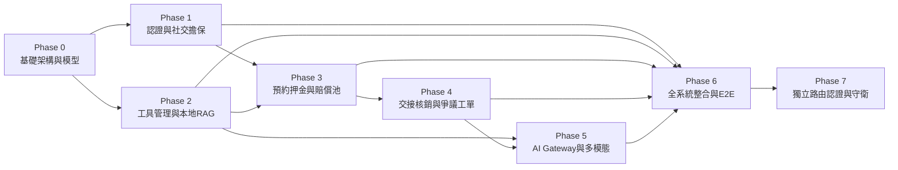

# LinLi Tool（鄰里工具）開發任務清單 (TODO.md)

- **基準文件**：
  - 功能規格書: [spec.md](file:///c:/Users/derick.chung_cycraft/Downloads/AI_PM/project/linli-tool-project/spec.md)
  - 產品需求書: [linli-tool-prd.md](file:///c:/Users/derick.chung_cycraft/Downloads/AI_PM/project/linli-tool-project/linli-tool-prd.md)
  - 前後端架構: [linli-tool-arch.md](file:///c:/Users/derick.chung_cycraft/Downloads/AI_PM/project/linli-tool-project/linli-tool-arch.md)
  - 設計指南: [design_guide.md](file:///c:/Users/derick.chung_cycraft/Downloads/AI_PM/project/linli-tool-project/design_guide.md) (品牌視覺與設計系統指南 v1.0)
- **設計架構**：採兩層式階層（Phase $\rightarrow$ Task $\rightarrow$ Subtask），循序漸進（基礎 $\rightarrow$ 進階），各 Phase 具備低耦合性與獨立可測試性。

---

## 階段導覽與獨立測試規劃

| Phase | 階段名稱 | 核心目標 | 獨立測試驗證方式 (Decoupled Testing) |
|---|---|---|---|
| **Phase 0** | 基礎架構與核心資料層 | 建立專案骨架、SQLite 連線與 ORM 模型 | 記憶體 SQLite 執行資料庫 Schema Migration 與 CRUD 測試 |
| **Phase 1** | 會員認證與社交擔保模組 | 手機 OTP 驗證、JWT 與 HMAC 邀請機制 | 使用 Mock 簡訊服務，測試 OTP 驗證、Token 簽名防偽與過期機制 |
| **Phase 2** | 工具管理與本地知識庫 | 社區多租戶工具 CRUD、U1/UC-4/UC-5 | 純本地 Markdown 檢索與 SQL 統計，零外部依賴測試 |
| **Phase 3** | 租借預約與賠償池核心 | 押金三級距折抵、取消退費、賠償池算式 | 純後端 Service 單元測試，邊界值測試與並發排他防重疊測試 |
| **Phase 4** | 取件交接與存證狀態機 | 60s 動態核銷碼、照片 Hash、爭議工單 | 使用 Mock 差分結果（MATCH/DIFF），驗證訂單狀態機流轉與退押金 |
| **Phase 5** | AI Gateway 與多模態進階 | 代理 Gemini API、D1 上架辨識、A2 搜尋 | 使用 Mock 或測試金鑰驗證 Prompt 解析、Rate Limit 與 4 大降級策略 |
| **Phase 6** | 前後端整合與 E2E 驗收 | 前端對接真實 API、全鏈路情境驗收 | 自動化測試腳本跑通「無傷結案」與「損壞觸發賠償池」完整流程 |
| **Phase 7** | 獨立路由認證與守衛重構 | 實作 /login、/login/otp 路由、RequireAuth 守衛、白名單檢驗與 30s 重發冷卻 | 路由跳轉單元測試、未登入攔截測試、30s 冷卻計時器與記憶體登入態驗證 |

---

## Phase 0：基礎架構與核心資料層建置 (Infrastructure & Data Layer)

> **階段目標**：完成後端模組拆分目錄、SQLite 資料庫連線，以及 6 張核心資料表與 Pydantic Schema 的定義，提供可獨立運作的 ORM 基礎。  
> **獨立驗收**：`pytest tests/unit/test_models.py` 通過，確認關聯約束與欄位型別皆正確。

- [x] **Task 0.1：後端模組目錄重構與環境變數管理**
  - [x] 建立 `backend/` 目錄結構（`routers/`, `services/`, `ai/`, `models.py`, `schemas.py`, `database.py`）。
  - [x] 配置 `python-dotenv` 與 `.env.example`，定義 `DATABASE_URL`, `JWT_SECRET`, `HMAC_SECRET`, `GEMINI_API_KEY`。
  - [x] 實作 FastAPI App Factory（`main.py`），掛載 CORS 中介層並僅負責路由註冊。
- [x] **Task 0.2：SQLAlchemy 2.0 ORM 模型定義 (`models.py`)**
  - [x] 實作 `Community` 模型（`id`, `name`, `address`, `created_at`）。
  - [x] 實作 `User` 模型（`phone` 唯一索引, `name`, `community_id`, `verification_status`, `credit_score` 預設 80）。
  - [x] 實作 `CommunityInvitation` 模型（`token` 唯一, `inviter_user_id`, `community_id`, `expires_at`, `is_used`）。
  - [x] 實作 `Item` 模型（`owner_id`, `community_id`, `daily_rate`, `market_value`, `damage_tool_id`, `status`）。
  - [x] 實作 `Order` 模型（`order_no`, `renter_id`, `lender_id`, `daily_rate`, `base_deposit`, `actual_deposit`, `status`, `handover_code`）。
  - [x] 實作 `DisputeTicket` 模型（`order_id`, `complainant_id`, `reason`, `status`, `evidence_photos`）。
- [x] **Task 0.3：Pydantic 資料驗證 Schema 定義 (`schemas.py`)**
  - [x] 定義 Request / Response Schemas（User, Community, Item, Order, Dispute）。
  - [x] 撰寫欄位驗證邏輯（如台灣門號正則 `^09\d{8}$`、金額大於 0、日期區間合法性）。
- [x] **Task 0.4：測試基底環境建置**
  - [x] 配置 `pytest`、`pytest-asyncio` 與 `httpx`。
  - [x] 撰寫 `tests/conftest.py`，配置 In-Memory SQLite Fixture 與自動 Session 清理。

---

## Phase 1：會員認證、社區歸屬與社交擔保模組 (SPEC_01)

> **階段目標**：實作安全的手機 OTP 驗證登入、JWT 認證機制、HMAC-SHA256 邀請防偽與社交擔保加入流程。  
> **獨立驗收**：不依賴商品與訂單，透過 `tests/api/test_auth.py` 驗證登入、核銷邀請碼與身分狀態流轉。

- [x] **Task 1.1：OTP 簡訊驗證碼服務 (`services/auth_service.py`)**
  - [x] 實作 6 碼隨機數字生成器與 TTL = 180 秒儲存結構（支援 In-Memory 或 Redis/SQLite）。
  - [x] 實作頻率限制：單一門號 24 小時上限 5 次，連續輸錯 3 次失效。
  - [x] 實作 Mock SMS Provider（測試環境自動輸出固定碼，生產環境保留 Twilio 介面）。
- [x] **Task 1.2：JWT 權限中介層與使用者端點 (`routers/users.py`)**
  - [x] 實作 JWT Token 簽發與解析器（HS256，內含 `user_id`, `community_id`, 效期 7 天）。
  - [x] 實作 FastAPI Dependency `get_current_user` 與 `get_validated_user`（檢查住戶認證狀態）。
  - [x] 實作 `GET /api/v1/users/me` 取得個人資料、信用分與所屬社區。
- [x] **Task 1.3：社交擔保與社區加入機制 (`routers/communities.py`)**
  - [x] 實作 `POST /api/v1/communities`：住戶冷啟動建立新社區，建立者自動設為 `VALIDATED`。
  - [x] 實作 `POST /api/v1/communities/{id}/invitations`：住戶產生具 HMAC-SHA256 簽名之 48 小時邀請碼。
  - [x] 實作 `POST /api/v1/communities/join`：
    - 憑有效邀請碼加入者立即獲得 `VALIDATED` 身分。
    - 邀請碼無效、過期或無邀請人者，身分設為 `PENDING`。
  - [x] 實作地址防重複檢核（若相似度 $\ge 85\%$ 提示社區已存在）。

---

## Phase 2：工具管理、本機知識庫與 RAG 輕量模組 (SPEC_02 Basic + RAG Local)

> **階段目標**：實作多租戶社區工具上架與清單查詢，以及「零外部 LLM 依賴」的本地知識庫檢索（U1、UC-4）與健康摘要（UC-5）。  
> **獨立驗收**：在無網路斷線環境下執行 `tests/api/test_items_rag.py`，確認本地檢索與健康指數在 50ms 內完成。

- [x] **Task 2.1：工具 CRUD 與社區資料隔離 (`services/item_service.py`)**
  - [x] 實作 `POST /api/v1/items`：上架工具，包含 `market_value` 驗證與示範工具 `damage_tool_id` 綁定。
  - [x] 實作 `GET /api/v1/items`：限制僅能查詢使用者所屬 `community_id` 之在架工具。
  - [x] 實作 `GET /api/v1/items/{id}`：工具詳情查詢（回傳配件清單、安全注意事項、出借人稱呼）。
  - [x] 實作 `PATCH /api/v1/items/{id}/status`：更新工具上下架與保養狀態。
- [x] **Task 2.2：U1 操作指引 FAQ 本地檢索模組 (`routers/rag.py`)**
  - [x] 整理 5 大示範工具之本地 Markdown 知識庫文件（存放在 `backend/knowledge_base/`）。
  - [x] 實作純文字/標籤關鍵字檢索函式（無 Token 費用，查詢延遲 $< 50\text{ms}$）。
  - [x] 實作 `POST /api/v1/rag/faq` 端點，回傳操作步驟與來源文件標記。
- [x] **Task 2.3：UC-4 出租端安全提醒模組**
  - [x] 建立工具危險等級對照表（如鏈鋸、砂輪機、震動電鑽為高風險動力工具）。
  - [x] 實作 `GET /api/v1/rag/safety/{category}`：上架與詳情頁提取護具提醒（護目鏡、防塵口罩）。
- [x] **Task 2.4：UC-5 裝備健康摘要運算引擎**
  - [x] 實作規則式計算：統計歷史完成次數、歷史損壞/爭議次數與損壞比率。
  - [x] 輸出健康等級判定（等級 A / B / C）與建議保養週期字串。
  - [x] 實作 `GET /api/v1/items/{id}/health` 端點。

---

## Phase 3：租借預約、押金計算與賠償池核心 (SPEC_03)

> **階段目標**：將金額計算全數移至後端 Service，實作防前端篡改之日租金、信用分三級距押金、取消政策與賠償池支出邏輯。  
> **獨立驗收**：執行 `tests/unit/test_order_service.py` 測試所有公式邊界值，並以並發腳本測試預約排他防衝突。

- [x] **Task 3.1：租期與押金試算核心 Service (`services/order_service.py`)**
  - [x] 實作租期計算：`rent_days = (end_date - start_date).days + 1`。
  - [x] 實作基準押金：`base_deposit = daily_rate * 15`。
  - [x] 實作信用分折抵邏輯：
    - $\ge 100$ 分：押金 0 元（折抵 100%）。
    - 80–99 分：押金 50%（四捨五入整數）。
    - $< 80$ 分：押金 100%（全額）。
  - [x] 實作 `POST /api/v1/orders/calculate` 預約費用即時試算端點。
  - [x] 實作金流預授權卡片資料結構與微文案規範（展示「租金 + 保障金 + 履約押金 = 授權總額」，按鈕為「發起預約並執行預授權鎖定」）。
- [x] **Task 3.2：預約下單與並發排他防衝突 (`routers/orders.py`)**
  - [x] 實作預約衝突檢查（同工具重疊租期排他鎖定）。
  - [x] 實作禁止借用本人工具檢查（`renter_id == lender_id` 阻擋）。
  - [x] 實作 `POST /api/v1/orders` 建立訂單，初始狀態設為 `CONFIRMED`。
- [x] **Task 3.3：取消政策與退費違約金計算**
  - [x] 實作取件前 24 小時判斷：
    - $\ge 24$ 小時：全額退還租金與押金，手續費 0。
    - $< 24$ 小時：收取 20% 租金手續費補貼出借人，退還 80% 租金與 100% 押金。
  - [x] 實作 `POST /api/v1/orders/{id}/cancel` 取消端點。
- [x] **Task 3.4：賠償池核心運算與資金帳本**
  - [x] 實作賠償金公式：
    - 殘值 $= \text{market\_value} \times 70\%$。
    - 應賠額：MINOR_DIFF 30% / DAMAGE_DETECTED 100%。
    - 賠償池支出 $= \max(0, \text{應賠} - \text{已收押金})$。
  - [x] 實作示範工具限制：非 5 項示範工具（`damage_tool_id` 為 null）自動回退純押金制。
  - [x] 實作賠償池不透支防護（若餘額不足，撥付額上限為當前餘額，餘額不為負）。
  - [x] 程式碼與 API 回傳文案嚴格排除「保險」、「保費」、「理賠」等金融法規禁語。

---

## Phase 4：取件交接、存證核銷與爭議處理 (SPEC_04 Basic)

> **階段目標**：完成實體交接之 60 秒動態 TOTP 核銷、Check-in 存證相片雜湊存檔、狀態機推進與爭議工單處理。  
> **獨立驗收**：Mock 差分判定結果，執行 `tests/api/test_handover.py` 驗證訂單從 CONFIRMED $\rightarrow$ PICKED_UP $\rightarrow$ IN_USE $\rightarrow$ COMPLETED / DISPUTED 的完整狀態跳轉。

- [x] **Task 4.1：取件動態核銷碼生成與核銷 (`services/handover_service.py`)**
  - [x] 實作基於 HMAC-SHA256 之 60 秒動態 TOTP 6 碼生成器。
  - [x] 實作 `GET /api/v1/orders/{id}/handover/code`（承租人取件碼，含倒數秒數與 QR Payload）。
  - [x] 實作 `POST /api/v1/orders/{id}/handover/verify`（出借人核驗碼，驗證成功變更為 `PICKED_UP`）。
- [x] **Task 4.2：Check-in 拍照存證與雜湊校驗**
  - [x] 實作 `POST /api/v1/orders/{id}/check-in`：借用人上傳初始照片。
  - [x] 計算相片 SHA-256 Checksum 存入資料庫存證，訂單狀態變更為 `IN_USE`。
  - [x] 實作 Ghost Overlay 相機引導視窗（4:3 比例、鮮黃虛線框 `border-2 border-dashed border-diyYellow-500`）。
  - [x] 整合 AI 相機助手（Vigilant Inspector LiLi）微文案：「請將工具置於引導框內，狸利會自動協助遮蔽住宅隱私」與「拍攝並標註初始舊傷，保護您的借用權益」。
- [x] **Task 4.3：歸還狀態機結案與信用分獎勵**
  - [x] 實作歸還結案處理函式：
    - 若比對結果為 `MATCH`：訂單狀態轉為 `COMPLETED`，押金全數退還，借用與出借雙方信用分各 $+2$。
    - 若比對為 `MINOR_DIFF` 或 `DAMAGE_DETECTED`：訂單轉為 `INSPECTION`，啟動 24 小時確認緩衝期。
  - [x] 實作 Check-out 歸還相機介面之 Ghost Overlay（疊加 Check-in 照片半透明層，opacity 0.35）。
  - [x] 實作微幅異動（MINOR_DIFF）之溫和微文案引導：「檢測到表面有微幅痕跡 (Diff: 0.18)，是否需補充清潔照或說明？」，排除 Anti-pattern 恐嚇字眼。
- [x] **Task 4.4：爭議申訴工單系統 (`routers/disputes.py`)**
  - [x] 實作 `POST /api/v1/disputes`：使用者對損壞判定不服時發起申訴，上傳舉證照片與理由。
  - [x] 訂單狀態變更為 `DISPUTED`，款項撥付自動鎖定凍結。
  - [x] 實作 `GET /api/v1/disputes/{id}` 查詢工單審理進度。

---

## Phase 5：AI Gateway 代理與多模態進階模組 (AI Gateway & Vision)

> **階段目標**：建置後端 AI Gateway 統一代理 Google Gemini API，實作 D1 拍照辨識預填、A2 情境搜尋標籤推薦與 Check-out 圖像差分比對。  
> **獨立驗收**：執行 `tests/ai/test_gateway.py`，使用 Mock 與金鑰驗證 Prompt 解析、Rate Limit 與 4 大降級保護。

- [x] **Task 5.1：後端 AI Gateway 基礎封裝 (`backend/ai/`)**
  - [x] 實作 `gemini_client.py`：封裝 Google GenAI SDK，設定連線逾時（1.5 秒）與指數退避重試（上限 3 次）。
  - [x] 實作 `gateway.py`：注入固化 System Prompts，管理 Token 使用與慢速日誌。
  - [x] 實作 API Rate Limiting（使用 `slowapi` 限制每位用戶每分鐘最多 5 次 AI 呼叫）。
  - [x] 實作 24 小時 Prompt 查詢快取機制（MD5 鍵值快取）。
- [x] **Task 5.2：A2 自然語言情境搜尋與標籤推薦 (`routers/rag.py`)**
  - [x] 撰寫 A2 Prompt：將自然語言輸入（如「客廳水泥牆裝層板」）對齊為封閉標籤集合。
  - [x] 實作 4 種降級處理：
    1. Gemini 逾時/斷線 $\rightarrow$ 降級至 SQL 關鍵字模糊搜尋。
    2. 有標籤無庫存 $\rightarrow$ 回傳無庫存提示與鄰近推薦。
    3. JSON 格式解析異常 $\rightarrow$ 正則表達式抽取字詞 Fallback。
    4. 範圍外問題（政治/非修繕） $\rightarrow$ 狸利（LiLi）吉祥物親切拒答。
  - [x] 實作 `POST /api/v1/rag/recommend` 端點。
- [x] **Task 5.3：D1 工具影像拍照辨識上架 (`routers/items.py`)**
  - [x] 撰寫 D1 Vision Prompt：上傳工具照片，識別工具品名、分類、隨附配件清單與安全建議。
  - [x] **強制規定**：Prompt 內明文禁止預估市價或租金。
  - [x] 實作 `POST /api/v1/items/recognize` 檔案上傳端點（經由 Gateway 呼叫 Gemini Vision）。
- [x] **Task 5.4：Check-out 雙圖差分比對引擎 (`routers/orders.py`)**
  - [x] 撰寫差分比對 Prompt：傳入 Check-in 與 Check-out 兩張圖片，要求比對結構性損傷、外殼裂痕、缺件。
  - [x] 設定規則：表面輕微灰塵、水漬或木屑粉塵應視為正常損耗，必須判定為 `MATCH`。
  - [x] 輸出規範：強制回傳標準 JSON（`result`, `confidence`, `difference_notes`）。
  - [x] 信心度 $< 0.60$ 時拋出 `422 IMAGE_TOO_BLURRY` 要求重拍。
  - [x] 實作 `POST /api/v1/orders/{id}/check-out` 端點。

---

## Phase 6：前後端整合、資安強化與全鏈路 E2E 驗收 (Integration & E2E)

> **階段目標**：完成前端 22 個畫面與後端 REST API 串接，徹底移除前端所有外部 LLM Direct Calls，完成全系統安全加固與端對端回歸測試。  
> **獨立驗收**：執行完整 E2E 測試腳本，自動模擬雙角色完成無傷與損壞兩種主線場景。

- [x] **Task 6.1：前端設計系統與 Design Tokens 建置 (`frontend/tailwind.config.js`)**
  - [x] 整合 `design_guide.md` 之 Tailwind CSS Config Extend（`diyYellow`, `diyDark`, `brandDark`, font, corner radius, shadows, `.glow-yellow`）。
  - [x] 建置 4 大核心 UI 元件庫（`CreditScoreBadge`, `PrimaryCTAButton`, `GhostOverlayViewfinder`, `PreAuthCard`）。
  - [x] 落實吉祥物「狸利 (LiLi)」4 大角色與插圖規範（迎賓導覽、AI 相機助手、信用守護者、物業值班員）。
  - [x] 依據微文案規範對照表，全面檢核並替換前端 22 個畫面之按鈕、提示與對話框文字（徹底排除「立即扣款」、「舊傷免責聲明」、「準備扣除押金」等 Anti-pattern）。
- [x] **Task 6.2：前端資料層全面重構與對接 (`frontend/src/services/`)**
  - [x] 修改 `api.ts`：對接後端 Auth、Items、Orders、Disputes 各端點，統一注入 JWT Token。
  - [x] 修改 `visionAI.ts`：移除原 Claude/Gemini BYOK 外部直連程式碼，改打後端 `/items/recognize` 與 `/orders/{id}/check-out`。
  - [x] 前端移除所有本機計算之押金與違約金邏輯，全面以 `/orders/calculate` 後端回傳為準。
- [x] **Task 6.3：全系統資安強化與資料隔離校驗**
  - [x] 社區資料隔離檢查：驗證非本社區用戶無法越權存取他人工具與訂單（IDOR 防護）。
  - [x] SQL Injection、XSS 與 CSRF 防護檢驗。
  - [x] 檢查所有推播與前端 UI 文案，確認無任何違規保險相關用詞。
- [x] **Task 6.4：端對端自動化情境測試 (E2E Test Scenarios)**
  - [x] **Scenario 1（無傷順利歸還主線）**：
    1. 使用者註冊 $\rightarrow$ 透過邀請碼加入社區（狀態為 VALIDATED）。
    2. 瀏覽工具 $\rightarrow$ 預約 3 天電鑽（信用分折抵押金）。
    3. 取件現場出示 6 碼動態核銷碼 $\rightarrow$ Check-in 拍照存證。
    4. 歸還 Check-out 拍照 $\rightarrow$ Gemini 判定 MATCH $\rightarrow$ 押金退還、信用分 +2。
  - [x] **Scenario 2（損壞觸發賠償池主線）**：
    1. 借用 5 項示範工具之一（如高壓清洗機）。
    2. Check-out 照片顯示噴槍外殼斷裂 $\rightarrow$ Gemini 判定 DAMAGE_DETECTED。
    3. 後端依公式計算殘值與應賠額，押金扣抵後差額自賠償池提撥。
    4. 建立爭議工單，凍結款項並通知出借雙方。

---

## Phase 7：獨立路由登入流程與白名單驗證重構 (SPEC_01 Extension: Standalone Auth Flow)

> **階段目標**：依據手機門號驗證流程圖（`RequireAuth` ➔ `/login` ➔ `/login/otp` ➔ `/explore`），將現有單頁 Modal 登入架構重構為獨立多路由架構，導入全域路由守衛、門號已知帳號白名單檢驗、30 秒重發冷卻與 In-Memory 登入狀態管理。  
> **獨立驗收**：未登入者存取受保護路由被 `RequireAuth` 強制重定向至 `/login`；未知門號輸入被即時阻斷於 `/login`；OTP 輸入介面具備 30 秒倒數計時與清空重填；驗證通過後 `refreshUser()` 寫入記憶體並自動導向 `/explore`。

- [ ] **Task 7.1：前端多路由架構與 RequireAuth 路由守衛 (`frontend/src/`)**
  - [ ] 導入前端路由庫（`react-router-dom`），建置獨立頁面路由架構：
    - 認證與登入路由：`/login`（門號輸入）、`/login/otp`（6 碼驗證碼輸入）
    - 平台主應用路由：`/explore`（探索主頁）、`/list`（上架）、`/cart`（預約）、`/checkin`（取件）、`/return`（歸還）
  - [ ] 實作全域路由守衛元件 `RequireAuth`（步驟 ①）：
    - 於 App 啟動及存取頁面時檢核 `currentUser` 狀態。
    - **已登入**：放行進入目標頁面。
    - **未登入**：全面攔截並自動導向 `/login` 頁面。
- [ ] **Task 7.2：`/login` 門號輸入與已知帳號檢核 (`routers/auth.py`, `frontend/src/`)**
  - [ ] 介面建置：建立 `/login` 頁面，提供符合台灣手機格式（`09xxxxxxxx`）之輸入欄位與送出按鈕。
  - [ ] 實作 `requestOtp(phone)` 與門號白名單檢核（步驟 ②）：
    - 門號檢核（是否為已知帳號？）：
      - **否（未知帳號）**：彈出紅框警示「查無此門號 請重新輸入」，阻斷發送 OTP，維持在 `/login` 頁面。
      - **是（已知帳號）**：向後端請求發送驗證碼，並透過 `router state` 將 `phone` 傳入，跳轉至 `/login/otp`（步驟 ③）。
  - [ ] 後端端點擴充：於 `/api/v1/auth/otp/send` 增加門號白名單檢查參數，或新增 `/api/v1/auth/check-phone` 供前端前置核驗。
- [ ] **Task 7.3：`/login/otp` 驗證碼頁面與 30 秒重發冷卻 (`frontend/src/`)**
  - [ ] 介面建置：建立 `/login/otp` 頁面，自 `router state` 提取門號，提供 6 碼數字輸入框。
  - [ ] 實作 30 秒重新發送冷卻計時器（步驟 ③ 虛線回流）：
    - 發送驗證碼後啟動 30 秒倒數計時（`cooldown = 30s`），期間鎖定重發按鈕。
    - 倒數結束後恢復按鈕，點擊仍呼叫 `requestOtp(phone)`。
  - [ ] 實作 `verifyOtp(phone, code)` 與格式校驗（步驟 ④）：
    - 檢核「帳號存在且為 6 位數字」。
    - 驗證碼不正確或失效：彈出紅框警示「驗證碼不正確 清空重填」，清空輸入欄位並留在 `/login/otp`。
    - 驗證成功：執行 `refreshUser()`。
- [ ] **Task 7.4：In-Memory 登入態管理與探索頁跳轉 (`frontend/src/`)**
  - [ ] 實作 `refreshUser()` 函式（步驟 ⑤）：
    - 將驗證通過之使用者資訊寫入 `currentUser` 狀態。
    - **僅記憶體機制（In-Memory Only）**：不持久化至 LocalStorage 或 SessionStorage，確保關閉瀏覽器或重整時符合安全規範。
  - [ ] 路由導向：登入成功後自動導向 `/explore` 探索主頁。
